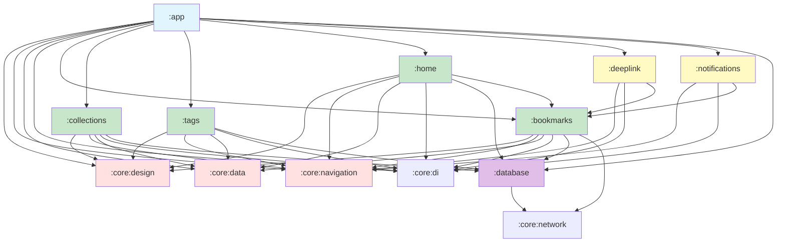

# LinkLibrary - Modular Architecture Plan

**Generated:** 2026-08-25
**Purpose:** Transform monolithic app into modular, scalable architecture
**Reference:** Based on PSCore KMP architecture patterns

---

## Table of Contents

1. [Executive Summary](#1-executive-summary)
2. [Current State Analysis](#2-current-state-analysis)
3. [Target Module Structure](#3-target-module-structure)
4. [Module Dependency Graph](#4-module-dependency-graph)
5. [Core Module Architecture](#5-core-module-architecture)
6. [Feature Module Architecture](#6-feature-module-architecture)
7. [External Link & Deep Link Handling](#7-external-link--deep-link-handling)
8. [Notification Action Architecture](#8-notification-action-architecture)
9. [Migration Strategy](#9-migration-strategy)
10. [Build Configuration](#10-build-configuration)
11. [DI Configuration](#11-di-configuration)
12. [Navigation Architecture](#12-navigation-architecture)
13. [Implementation Phases](#13-implementation-phases)

---

## 1. Executive Summary

### Goals
- Transform `:app` into lightweight orchestration layer
- Extract reusable UI components into `:core:design`
- Separate business logic into feature modules (`:bookmarks`, `:collections`, `:tags`, `:home`)
- Enable external link handling and deep linking across modules
- Support notification actions that navigate to specific screens
- Maintain KMP structure (Android/JVM/WASM)

### Key Principles
1. **Single Responsibility**: Each module owns one feature/capability
2. **Dependency Inversion**: Features depend on abstractions in `:core`, not each other
3. **Isolation**: Feature modules can be developed/tested independently
4. **Reusability**: `:core:design` provides design system for all features
5. **Scalability**: New features can be added as independent modules

---

## 2. Current State Analysis

### Current Structure
```
LinkLibrary/
├── app/
│   ├── src/commonMain/kotlin/com/greenrobotdev/linklibrary/
│   │   ├── screens/          # All screens (home, add, library, etc.)
│   │   ├── components/       # Shared UI components
│   │   ├── model/           # Domain models
│   │   └── navigation/       # Navigation setup
│   └── build.gradle.kts
├── database/
│   ├── Room database entities
│   ├── Repositories
│   └── DI modules
└── design/
    └── HTML specifications
```

### Problems with Current Architecture
1. **Bloated `:app` module** - Contains all UI, logic, and components
2. **Tight coupling** - Screens directly reference database entities
3. **No clear boundaries** - Hard to test features in isolation
4. **Mixed concerns** - UI, business logic, and data access intertwined
5. **Difficult to scale** - Adding features requires modifying app module

---

## 3. Target Module Structure

```
LinkLibrary/
├── app/                          # Lightweight orchestration & entry point
│   ├── android/                  # Android application target
│   ├── desktop/                  # Desktop application target
│   ├── wasm/                     # WASM application target
│   └── build.gradle.kts
│
├── core/                         # Foundation infrastructure
│   ├── design/                   # ✨ Design system & UI components
│   │   ├── src/commonMain/
│   │   │   ├── theme/           # Material 3 theme, typography, colors
│   │   │   ├── components/      # Reusable UI components
│   │   │   ├── tokens/          # Design tokens (spacing, elevation)
│   │   │   └── foundation/      # Base composables (buttons, cards, etc.)
│   │   └── build.gradle.kts
│   │
│   ├── navigation/              # Navigation architecture
│   │   ├── src/commonMain/
│   │   │   ├── NavigationState.kt
│   │   │   ├── Navigator.kt
│   │   │   └── NavKeys.kt
│   │   └── build.gradle.kts
│   │
│   ├── data/                     # Data layer infrastructure
│   │   ├── src/commonMain/
│   │   │   ├── repository/      # Base repository interfaces
│   │   │   ├── result/          # Result wrapper types
│   │   │   └── pagination/      # Pagination utilities
│   │   └── build.gradle.kts
│   │
│   ├── network/                  # Networking infrastructure
│   │   ├── src/commonMain/
│   │   │   ├── HttpClient.kt    # Ktor configuration
│   │   │   ├── api/             # API service base classes
│   │   │   └── interceptors/    # Auth, logging, telemetry
│   │   └── build.gradle.kts
│   │
│   ├── di/                       # Dependency injection foundation
│   │   ├── src/commonMain/
│   │   │   ├── KoinModules.kt   # Platform-specific DI
│   │   │   └── qualifiers/      # Named dependencies
│   │   └── build.gradle.kts
│   │
│   └── utils/                    # Shared utilities
│       ├── src/commonMain/
│       │   ├── date/            # Date/time utilities
│       │   ├── serialization/   # JSON configuration
│       │   └── logging/         # Logging utilities
│       └── build.gradle.kts
│
├── database/                     # Data persistence (existing)
│   ├── Room entities
│   ├── DAOs
│   ├── Repositories
│   └── build.gradle.kts
│
├── bookmarks/                    # 📑 Core bookmarks feature
│   ├── src/commonMain/
│   │   ├── data/
│   │   │   ├── repository/      # BookmarkRepository
│   │   │   ├── model/           # Link, Bookmark domain models
│   │   │   └── dto/             # API DTOs
│   │   ├── domain/
│   │   │   ├── usecase/         # AddBookmark, DeleteBookmark, etc.
│   │   │   └── mapper/          # Entity ↔ Domain mapping
│   │   ├── presentation/
│   │   │   ├── addlink/         # AddLinkScreen + ViewModel
│   │   │   ├── library/         # LibraryScreen + ViewModel
│   │   │   └── details/         # LinkDetailScreen + ViewModel
│   │   └── di/
│   │       └── BookmarkModule.kt
│   └── build.gradle.kts
│
├── collections/                  # 📁 Collections feature
│   ├── src/commonMain/
│   │   ├── data/
│   │   │   ├── repository/      # CollectionRepository
│   │   │   └── model/           # Collection domain model
│   │   ├── domain/
│   │   │   ├── usecase/         # AddCollection, DeleteCollection
│   │   │   └── mapper/
│   │   ├── presentation/
│   │   │   ├── CollectionsScreen.kt
│   │   │   ├── AddCollectionScreen.kt
│   │   │   └── viewmodels/
│   │   └── di/
│   │       └── CollectionModule.kt
│   └── build.gradle.kts
│
├── tags/                         # 🏷️ Tags feature
│   ├── src/commonMain/
│   │   ├── data/
│   │   │   ├── repository/      # TagRepository
│   │   │   └── model/           # Tag domain model
│   │   ├── domain/
│   │   │   ├── usecase/         # AddTag, DeleteTag
│   │   │   └── mapper/
│   │   ├── presentation/
│   │   │   ├── TagListScreen.kt
│   │   │   ├── AddTagScreen.kt
│   │   │   └── viewmodels/
│   │   └── di/
│   │       └── TagModule.kt
│   └── build.gradle.kts
│
├── home/                         # 🏠 Home/dashboard feature
│   ├── src/commonMain/
│   │   ├── presentation/
│   │   │   ├── HomeScreen.kt    # Already Material 3 updated
│   │   │   └── HomeViewModel.kt
│   │   ├── domain/
│   │   │   └── usecase/         # GetRecentLinks, GetFavorites
│   │   └── di/
│   │       └── HomeModule.kt
│   └── build.gradle.kts
│
├── deeplink/                     # 🔗 Deep link handling
│   ├── src/commonMain/
│   │   ├── handler/
│   │   │   ├── DeepLinkHandler.kt
│   │   │   └── ExternalLinkHandler.kt
│   │   ├── model/
│   │   │   ├── DeepLinkRequest.kt
│   │   │   └── LinkAction.kt
│   │   └── navigation/
│   │       └── DeepLinkNavigation.kt
│   ├── src/androidMain/
│   │   └── intent/
│   │       └── DeepLinkIntentReceiver.kt
│   └── build.gradle.kts
│
├── notifications/                 # 🔔 Notification handling
│   ├── src/commonMain/
│   │   ├── handler/
│   │   │   └── NotificationActionHandler.kt
│   │   ├── model/
│   │   │   └── NotificationAction.kt
│   │   └── navigation/
│   │       └── NotificationNavigation.kt
│   ├── src/androidMain/
│   │   ├── receiver/
│   │   │   └── NotificationActionReceiver.kt
│   │   └── service/
│   │       └── NotificationClickService.kt
│   └── build.gradle.kts
│
└── build-logic/                  # Gradle convention plugins
    ├── convention/src/main/kotlin/
    │   ├── LinkLibraryConventionPlugin.kt
    │   └── LinkLibraryLibraryConventionPlugin.kt
    └── build.gradle.kts
```

---

## 4. Module Dependency Graph



### Dependency Rules
1. **:app** depends on feature modules, never the reverse
2. **Feature modules** depend on :core modules, never other features (except :home → :bookmarks)
3. **:core:design** has NO dependencies on other modules
4. **:database** can depend on :core:network
5. **Feature modules** can depend on :database

---

## 5. Core Module Architecture

### 5.1 :core:design - Design System

**Purpose:** Centralized Material 3 design system for all features

#### File Structure
```
:core:design/
├── src/commonMain/kotlin/com/greenrobotdev/linklibrary/core/design/
│   ├── theme/
│   │   ├── Color.kt              # ColorScheme definitions
│   │   ├── Typography.kt          # Typography scale
│   │   ├── Shape.kt              # Shape tokens
│   │   ├── Elevation.kt           # Elevation levels
│   │   ├── Spacing.kt             # 8dp spacing system
│   │   └── Theme.kt              # MaterialTheme composition
│   │
│   ├── tokens/
│   │   ├── ColorTokens.kt        # MD3 color token mappings
│   │   ├── TypeTokens.kt          # Typography token mappings
│   │   └── ShapeTokens.kt        # Shape token mappings
│   │
│   ├── foundation/
│   │   ├── button/
│   │   │   ├── FilledButton.kt
│   │   │   ├── OutlinedButton.kt
│   │   │   ├── TextButton.kt
│   │   │   └── FilledTonalButton.kt
│   │   ├── card/
│   │   │   ├── Card.kt
│   │   │   ├── ElevatedCard.kt
│   │   │   └── OutlinedCard.kt
│   │   ├── textfield/
│   │   │   ├── FilledTextField.kt
│   │   │   └── OutlinedTextField.kt
│   │   ├── chip/
│   │   │   ├── AssistChip.kt
│   │   │   ├── FilterChip.kt
│   │   │   ├── InputChip.kt
│   │   │   └── SuggestionChip.kt
│   │   └── fab/
│   │       ├── FloatingActionButton.kt
│   │       └── ExtendedFloatingActionButton.kt
│   │
│   ├── components/
│   │   ├── layout/
│   │   │   ├── AppScaffold.kt     # Adaptive scaffold (desktop/mobile)
│   │   │   ├── TopAppBar.kt       # M3 top app bars
│   │   │   └── BottomAppBar.kt    # M3 bottom app bars
│   │   ├── navigation/
│   │   │   ├── NavigationBar.kt   # M3 navigation bar
│   │   │   ├── NavigationRail.kt  # M3 navigation rail
│   │   │   └── NavigationDrawer.kt
│   │   ├── feedback/
│   │   │   ├── LoadingIndicator.kt
│   │   │   ├── ErrorView.kt
│   │   │   ├── EmptyStateView.kt
│   │   │   └── Snackbar.kt
│   │   ├── list/
│   │   │   ├── LazyGrid.kt        # Responsive grid
│   │   │   ├── LazyList.kt        # Responsive list
│   │   │   └── ListItem.kt        # M3 list item
│   │   └── input/
│   │       ├── SearchBar.kt       # M3 search bar
│   │       └── DatePicker.kt     # M3 date picker
│   │
│   └── resources/
│       └── composeResources/
│           ├── values/
│           │   └── strings.xml
│           └── drawables/
│
└── build.gradle.kts
```

#### Dependencies
```kotlin
dependencies {
    // Compose Multiplatform
    implementation(compose.runtime)
    implementation(compose.foundation)
    implementation(compose.material3)
    implementation(compose.materialIconsExtended)
    
    // Navigation (for navigation components)
    implementation(libs.androidx.navigation3)
    
    // Koin (for theme injection if needed)
    implementation(libs.koin.core)
}
```

#### Key Components

**1. Theme.kt**
```kotlin
@Composable
fun LinkLibraryTheme(
    darkTheme: Boolean = isSystemInDarkTheme(),
    dynamicColor: Boolean = true,  // Android 12+
    content: @Composable () -> Unit
) {
    val colorScheme = when {
        dynamicColor && Build.VERSION.SDK_INT >= Build.VERSION_CODES.S -> {
            if (darkTheme) dynamicDarkColorScheme(localContext)
            else dynamicLightColorScheme(localContext)
        }
        darkTheme -> darkColorScheme()
        else -> lightColorScheme()
    }

    MaterialTheme(
        colorScheme = colorScheme,
        typography = Typography,
        shapes = Shapes,
        content = content
    )
}
```

**2. AppScaffold.kt**
```kotlin
@Composable
fun AppScaffold(
    topBar: @Composable () -> Unit = {},
    bottomBar: @Composable () -> Unit = {},
    floatingActionButton: @Composable () -> Unit = {},
    content: @Composable (PaddingValues) -> Unit
) {
    // Adaptive scaffold based on window size class
    // Uses navigation rail on medium+, bottom nav on compact
    Scaffold(
        topBar = topBar,
        bottomBar = bottomBar,
        floatingActionButton = floatingActionButton,
        content = content
    )
}
```

### 5.2 :core:navigation - Navigation Architecture

**Purpose:** Centralized navigation system with type-safe routing

#### File Structure
```
:core:navigation/
├── src/commonMain/kotlin/com/greenrobotdev/linklibrary/core/navigation/
│   ├── NavigationState.kt        # Navigation state management
│   ├── Navigator.kt             # Navigation controller
│   ├── NavKeys.kt                # Route definitions
│   ├── NavGraph.kt              # Navigation graph builder
│   └── NavExtensions.kt         # Navigation utility functions
│
└── build.gradle.kts
```

#### Navigation Pattern
```kotlin
// NavKeys.kt
@Serializable
sealed class NavKeys : NavKey {
    // Home
    @Serializable
    data object Home : NavKeys()
    
    // Bookmarks
    @Serializable
    data class Library(val collectionId: String? = null) : NavKeys()
    
    @Serializable
    data class AddLink(val initialUrl: String? = null) : NavKeys()
    
    @Serializable
    data class LinkDetail(val linkId: String) : NavKeys()
    
    // Collections
    @Serializable
    data object Collections : NavKeys()
    
    @Serializable
    data object AddCollection : NavKeys()
    
    // Tags
    @Serializable
    data object Tags : NavKeys()
    
    @Serializable
    data object AddTag : NavKeys()
}

// Navigator.kt
class Navigator(
    private val navController: NavHostController
) {
    fun navigateTo(route: NavKey) {
        navController.navigate(route)
    }
    
    fun navigateBack() {
        navController.popBackStack()
    }
    
    fun replace(route: NavKey) {
        navController.navigate(route) {
            popUpTo(navController.graph.startDestinationId) { inclusive = true }
        }
    }
}
```

### 5.3 :core:data - Data Layer Infrastructure

**Purpose:** Base repository interfaces, result types, pagination

#### File Structure
```
:core:data/
├── src/commonMain/kotlin/com/greenrobotdev/linklibrary/core/data/
│   ├── repository/
│   │   ├── Repository.kt         # Base repository interface
│   │   └── PaginatedRepository.kt
│   ├── result/
│   │   ├── Result.kt             # Result<Success, Error>
│   │   └── NetworkResult.kt
│   ├── pagination/
│   │   ├── Pagination.kt
│   │   └── Page.kt
│   └── mapper/
│       └── Mapper.kt            # Entity ↔ Domain mapper interface
│
└── build.gradle.kts
```

---

## 6. Feature Module Architecture

### 6.1 :bookmarks - Core Bookmarks Feature

**Purpose:** Manage links/bookmarks, the central feature

#### Structure
```
:bookmarks/
├── src/commonMain/kotlin/com/greenrobotdev/linklibrary/bookmarks/
│   ├── data/
│   │   ├── repository/
│   │   │   └── BookmarkRepository.kt
│   │   ├── model/
│   │   │   ├── Link.kt           # Domain model
│   │   │   ├── Bookmark.kt
│   │   │   └── LinkWithMetadata.kt
│   │   └── dto/
│   │       └── LinkDto.kt       # API DTOs
│   │
│   ├── domain/
│   │   ├── usecase/
│   │   │   ├── GetLinksUseCase.kt
│   │   │   ├── GetLinkByIdUseCase.kt
│   │   │   ├── AddLinkUseCase.kt
│   │   │   ├── UpdateLinkUseCase.kt
│   │   │   ├── DeleteLinkUseCase.kt
│   │   │   ├── ToggleFavoriteUseCase.kt
│   │   │   └── SearchLinksUseCase.kt
│   │   └── mapper/
│   │       └── LinkMapper.kt    # LinkEntity ↔ Link
│   │
│   ├── presentation/
│   │   ├── addlink/
│   │   │   ├── AddLinkScreen.kt
│   │   │   ├── AddLinkViewModel.kt
│   │   │   ├── AddLinkAIIntegration.kt
│   │   │   └── AddLinkUseCase.kt
│   │   ├── library/
│   │   │   ├── LibraryScreen.kt
│   │   │   ├── LibraryViewModel.kt
│   │   │   └── LibraryUseCase.kt
│   │   └── details/
│   │       ├── LinkDetailScreen.kt
│   │       ├── LinkDetailViewModel.kt
│   │       └── LinkDetailUseCase.kt
│   │
│   ├── di/
│   │   └── BookmarkModule.kt     # Koin DI
│   │
│   └── navigation/
│       └── BookmarkNavigation.kt # Navigation helpers
│
└── build.gradle.kts
```

#### Dependencies
```kotlin
dependencies {
    implementation(project(":core:design"))
    implementation(project(":core:navigation"))
    implementation(project(":core:data"))
    implementation(project(":core:network"))
    implementation(project(":database"))
    
    // Compose
    implementation(compose.runtime)
    implementation(compose.foundation)
    implementation(compose.material3)
    implementation(compose.materialIconsExtended)
    
    // Navigation
    implementation(libs.androidx.navigation3)
    
    // Koin
    implementation(libs.koin.core)
    
    // Molecule (if using state management)
    implementation(libs.molecule.runtime)
}
```

#### Koin Module
```kotlin
val bookmarkModule = module {
    // Repository
    single<BookmarkRepository> { RoomBookmarkRepository(get(), get(), get()) }
    
    // Use Cases
    factory { GetLinksUseCase(get()) }
    factory { GetLinkByIdUseCase(get()) }
    factory { AddLinkUseCase(get(), get()) }
    factory { UpdateLinkUseCase(get()) }
    factory { DeleteLinkUseCase(get()) }
    factory { ToggleFavoriteUseCase(get()) }
    factory { SearchLinksUseCase(get()) }
    
    // ViewModels (scoped to navigation)
    factory { params -> AddLinkViewModel(get(), get(), get()) }
    factory { params -> LibraryViewModel(get(), get()) }
    factory { params -> LinkDetailViewModel(get(), get()) }
}
```

### 6.2 :collections - Collections Feature

**Purpose:** Manage collections/folders for organizing links

#### Structure (similar to :bookmarks)
```
:collections/
├── src/commonMain/kotlin/com/greenrobotdev/linklibrary/collections/
│   ├── data/
│   │   ├── repository/
│   │   │   └── CollectionRepository.kt
│   │   └── model/
│   │       └── Collection.kt
│   ├── domain/
│   │   ├── usecase/
│   │   │   ├── GetCollectionsUseCase.kt
│   │   │   ├── AddCollectionUseCase.kt
│   │   │   ├── UpdateCollectionUseCase.kt
│   │   │   └── DeleteCollectionUseCase.kt
│   │   └── mapper/
│   │       └── CollectionMapper.kt
│   ├── presentation/
│   │   ├── CollectionsScreen.kt
│   │   ├── CollectionsViewModel.kt
│   │   ├── AddCollectionScreen.kt
│   │   └── AddCollectionViewModel.kt
│   ├── di/
│   │   └── CollectionModule.kt
│   └── navigation/
│       └── CollectionNavigation.kt
│
└── build.gradle.kts
```

### 6.3 :tags - Tags Feature

**Purpose:** Manage tags for categorizing links

#### Structure
```
:tags/
├── src/commonMain/kotlin/com/greenrobotdev/linklibrary/tags/
│   ├── data/
│   │   ├── repository/
│   │   │   └── TagRepository.kt
│   │   └── model/
│   │       └── Tag.kt
│   ├── domain/
│   │   ├── usecase/
│   │   │   ├── GetTagsUseCase.kt
│   │   │   ├── AddTagUseCase.kt
│   │   │   ├── UpdateTagUseCase.kt
│   │   │   └── DeleteTagUseCase.kt
│   │   └── mapper/
│   │       └── TagMapper.kt
│   ├── presentation/
│   │   ├── TagListScreen.kt
│   │   ├── TagListViewModel.kt
│   │   ├── AddTagScreen.kt
│   │   └── AddTagViewModel.kt
│   ├── di/
│   │   └── TagModule.kt
│   └── navigation/
│       └── TagNavigation.kt
│
└── build.gradle.kts
```

### 6.4 :home - Home/Dashboard Feature

**Purpose:** Home screen with recent links, favorites, and quick actions

#### Structure
```
:home/
├── src/commonMain/kotlin/com/greenrobotdev/linklibrary/home/
│   ├── presentation/
│   │   ├── HomeScreen.kt          # Already Material 3 updated
│   │   └── HomeViewModel.kt
│   ├── domain/
│   │   └── usecase/
│   │       ├── GetRecentLinksUseCase.kt
│   │       ├── GetFavoriteLinksUseCase.kt
│   │       └── GetQuickStatsUseCase.kt
│   ├── di/
│   │   └── HomeModule.kt
│   └── navigation/
│       └── HomeNavigation.kt
│
└── build.gradle.kts
```

---

## 7. External Link & Deep Link Handling

### 7.1 :deeplink Module Architecture

**Purpose:** Handle external URLs and deep links from other apps

#### Structure
```
:deeplink/
├── src/commonMain/kotlin/com/greenrobotdev/linklibrary/deeplink/
│   ├── handler/
│   │   ├── DeepLinkHandler.kt    # Main deeplink coordinator
│   │   └── ExternalLinkHandler.kt  # Process external URLs
│   ├── model/
│   │   ├── DeepLinkRequest.kt     # Deeplink request model
│   │   ├── LinkAction.kt          # Actions (ADD, VIEW, SEARCH)
│   │   └── LinkSource.kt          # Source tracking (share, browser, etc.)
│   ├── navigation/
│   │   └── DeepLinkNavigation.kt  # Route deeplinks to screens
│   └── parser/
│       └── UrlParser.kt          # Parse URL metadata
│
├── src/androidMain/kotlin/com/greenrobotdev/linklibrary/deeplink/
│   ├── intent/
│   │   └── DeepLinkIntentReceiver.kt  # Handle Android intents
│   └── manifest/
│       └── DeepLinkIntentFilter.kt
│
└── build.gradle.kts
```

#### Deep Link Flow

```
┌─────────────────────────────────────────────────────────────┐
│ 1. External Source (Browser, Share Sheet, QR Code)         │
└──────────────────────┬──────────────────────────────────────┘
                       │
┌──────────────────────▼──────────────────────────────────────┐
│ 2. DeepLinkIntentReceiver (Android) / Web Handler (WASM)   │
│    - Extract URL from intent/window.location                 │
│    - Determine action (ADD_LINK, VIEW_LINK, etc.)            │
└──────────────────────┬──────────────────────────────────────┘
                       │
┌──────────────────────▼──────────────────────────────────────┐
│ 3. DeepLinkHandler                                          │
│    - Parse URL                                              │
│    - Extract metadata (title, description)                  │
│    - Determine source                                       │
└──────────────────────┬──────────────────────────────────────┘
                       │
┌──────────────────────▼──────────────────────────────────────┐
│ 4. DeepLinkNavigation                                       │
│    - Route to appropriate screen                             │
│    - Pass pre-filled data                                   │
└──────────────────────┬──────────────────────────────────────┘
                       │
         ┌─────────────┴──────────────┐
         │                              │
┌────────▼──────────┐        ┌─────────▼─────────┐
│ AddLinkScreen     │        │ LinkDetailScreen  │
│ (URL pre-filled)  │        │ (Existing link)   │
└───────────────────┘        └───────────────────┘
```

#### Implementation

**DeepLinkHandler.kt**
```kotlin
class DeepLinkHandler(
    private val urlParser: UrlParser,
    private val bookmarkRepository: BookmarkRepository
) {
    suspend fun handleDeepLink(request: DeepLinkRequest): DeepLinkResult {
        // Parse URL
        val url = urlParser.parse(request.url)
        
        // Check if link already exists
        val existingLink = bookmarkRepository.findByUrl(url)
        
        return when (request.action) {
            LinkAction.ADD -> {
                if (existingLink != null) {
                    DeepLinkResult.NavigateToDetail(existingLink.id)
                } else {
                    val metadata = urlParser.fetchMetadata(url)
                    DeepLinkResult.NavigateToAdd(metadata)
                }
            }
            LinkAction.VIEW -> {
                if (existingLink != null) {
                    DeepLinkResult.NavigateToDetail(existingLink.id)
                } else {
                    DeepLinkResult.NavigateToAdd(url.toString())
                }
            }
        }
    }
}
```

**DeepLinkNavigation.kt**
```kotlin
fun Navigator.handleDeepLink(result: DeepLinkResult) {
    when (result) {
        is DeepLinkResult.NavigateToAdd -> {
            navigateTo(NavKeys.AddLink(result.url))
        }
        is DeepLinkResult.NavigateToDetail -> {
            navigateTo(NavKeys.LinkDetail(result.linkId))
        }
        is DeepLinkResult.NavigateToSearch -> {
            navigateTo(NavKeys.Library(query = result.query))
        }
    }
}
```

#### Android Manifest Configuration

```xml
<!-- In :app/android/AndroidManifest.xml -->
<activity
    android:name=".MainActivity"
    android:exported="true">
    
    <!-- App Links (https://linklibrary.app) -->
    <intent-filter android:autoVerify="true">
        <action android:name="android.intent.action.VIEW" />
        <category android:name="android.intent.category.DEFAULT" />
        <category android:name="android.intent.category.BROWSABLE" />
        <data
            android:scheme="https"
            android:host="linklibrary.app"
            android:pathPattern="/.*" />
    </intent-filter>
    
    <!-- Custom Scheme (linklibrary://) -->
    <intent-filter>
        <action android:name="android.intent.action.VIEW" />
        <category android:name="android.intent.category.DEFAULT" />
        <category android:name="android.intent.category.BROWSABLE" />
        <data
            android:scheme="linklibrary"
            android:host="add"
            android:path="/link" />
    </intent-filter>
    
    <!-- Share Text/URL -->
    <intent-filter>
        <action android:name="android.intent.action.SEND" />
        <category android:name="android.intent.category.DEFAULT" />
        <data android:mimeType="text/plain" />
    </intent-filter>
</activity>
```

#### Deep Link URL Patterns

```
# App Links
https://linklibrary.app/add?url={url}
https://linklibrary.app/link/{id}
https://linklibrary.app/collection/{id}
https://linklibrary.app/search?q={query}

# Custom Scheme
linklibrary://add/link?url={url}
linklibrary://view/link/{id}
linklibrary://share?url={url}&title={title}
```

---

## 8. Notification Action Architecture

### 8.1 :notifications Module Architecture

**Purpose:** Handle notification clicks and actions

#### Structure
```
:notifications/
├── src/commonMain/kotlin/com/greenrobotdev/linklibrary/notifications/
│   ├── handler/
│   │   └── NotificationActionHandler.kt  # Process notification actions
│   ├── model/
│   │   ├── NotificationAction.kt       # Action types
│   │   └── NotificationIntent.kt       # Intent model
│   └── navigation/
│       └── NotificationNavigation.kt   # Route actions to screens
│
├── src/androidMain/kotlin/com/greenrobotdev/linklibrary/notifications/
│   ├── receiver/
│   │   └── NotificationActionReceiver.kt  # BroadcastReceiver for actions
│   └── service/
│       └── NotificationClickService.kt    # Handle notification clicks
│
└── build.gradle.kts
```

#### Notification Flow

```
┌─────────────────────────────────────────────────────────────┐
│ 1. User taps notification action button                       │
│    - "Add to favorites"                                     │
│    - "Open link"                                             │
│    - "Share link"                                            │
└──────────────────────┬──────────────────────────────────────┘
                       │
┌──────────────────────▼──────────────────────────────────────┐
│ 2. NotificationActionReceiver (Android)                     │
│    - Extract action type and data                           │
│    - Pass to handler                                        │
└──────────────────────┬──────────────────────────────────────┘
                       │
┌──────────────────────▼──────────────────────────────────────┐
│ 3. NotificationActionHandler                                │
│    - Execute action (toggle favorite, etc.)                  │
│    - Return navigation target                               │
└──────────────────────┬──────────────────────────────────────┘
                       │
┌──────────────────────▼──────────────────────────────────────┐
│ 4. NotificationNavigation                                  │
│    - Navigate to appropriate screen with result            │
└──────────────────────┬──────────────────────────────────────┘
                       │
         ┌─────────────┴──────────────┐
         │                              │
┌────────▼──────────┐        ┌─────────▼─────────┐
│ LinkDetailScreen  │        │ LibraryScreen     │
│ (with updated     │        │ (with action      │
│  favorite status) │        │  result toast)    │
└───────────────────┘        └───────────────────┘
```

#### Implementation

**NotificationAction.kt**
```kotlin
sealed interface NotificationAction {
    data class ToggleFavorite(val linkId: String) : NotificationAction
    data class OpenLink(val linkId: String) : NotificationAction
    data class ShareLink(val linkId: String) : NotificationAction
    data class AddToCollection(val linkId: String, val collectionId: String) : NotificationAction
}
```

**NotificationActionHandler.kt**
```kotlin
class NotificationActionHandler(
    private val toggleFavoriteUseCase: ToggleFavoriteUseCase
) {
    suspend fun handleAction(action: NotificationAction): NavigationTarget {
        return when (action) {
            is NotificationAction.ToggleFavorite -> {
                toggleFavoriteUseCase(action.linkId)
                NavigationTarget.LinkDetail(action.linkId)
            }
            is NotificationAction.OpenLink -> {
                NavigationTarget.LinkDetail(action.linkId)
            }
            is NotificationAction.ShareLink -> {
                NavigationTarget.LinkDetail(action.linkId, showShareSheet = true)
            }
            is NotificationAction.AddToCollection -> {
                NavigationTarget.LinkDetail(action.linkId, collectionId = action.collectionId)
            }
        }
    }
}
```

**NotificationActionReceiver.kt (Android)**
```kotlin
class NotificationActionReceiver : BroadcastReceiver() {
    override fun onReceive(context: Context, intent: Intent) {
        val action = intent.extras?.getSerializable("action") as? NotificationAction
        val handler = NotificationActionHandler(get())
        
        GlobalScope.launch {
            val target = handler.handleAction(action ?: return@launch)
            // Navigate using deep link or start activity with result
        }
    }
}
```

#### Notification Example

```kotlin
// Show notification with actions
fun showLinkNotification(context: Context, link: Link) {
    val notification = NotificationCompat.Builder(context, "links")
        .setContentTitle(link.title)
        .setContentText(link.description)
        .setSmallIcon(R.drawable.ic_link)
        .addAction(
            R.drawable.ic_favorite,
            "Add to favorites",
            createFavoriteActionIntent(context, link.id)
        )
        .addAction(
            R.drawable.ic_share,
            "Share",
            createShareActionIntent(context, link.id)
        )
        .build()
        
    notificationManager.notify(link.id.hashCode(), notification)
}

fun createFavoriteActionIntent(context: Context, linkId: String): Intent {
    return Intent(context, NotificationActionReceiver::class.java).apply {
        action = "com.greenrobotdev.linklibrary.FAVORITE"
        putExtra("action", NotificationAction.ToggleFavorite(linkId))
    }
}
```

---

## 9. Migration Strategy

### Phase 1: Foundation (Week 1-2)
1. Create `:core:design` module
   - Extract theme from `:app`
   - Create foundation components (buttons, cards, chips)
   - Setup design tokens
2. Create `:core:navigation` module
   - Move navigation setup from `:app`
   - Define NavKeys for all screens
3. Create `:build-logic` convention plugins
   - Setup KMP library plugin
   - Configure consistent module settings

### Phase 2: Database & Core (Week 3)
1. Keep `:database` as-is (already modular)
2. Create `:core:data` module
   - Add Result types
   - Add repository base classes
3. Update `:app` to depend on new core modules

### Phase 3: Feature Modules (Week 4-6)
1. Create `:bookmarks` module
   - Move AddLinkScreen, LibraryScreen, LinkDetailScreen
   - Move ViewModels and UseCases
   - Setup Koin module
2. Create `:collections` module
   - Move CollectionsScreen, AddCollectionScreen
3. Create `:tags` module
   - Move TagListScreen, AddTagScreen
4. Create `:home` module
   - Move HomeScreen (already updated)
5. Update `:app` to depend on feature modules

### Phase 4: Advanced Features (Week 7-8)
1. Create `:deeplink` module
   - Implement DeepLinkHandler
   - Setup Android manifest intent filters
2. Create `:notifications` module
   - Implement NotificationActionHandler
   - Setup BroadcastReceiver
3. Test deep linking and notifications

### Phase 5: Cleanup & Optimization (Week 9)
1. Remove old code from `:app`
2. Update imports across modules
3. Run tests and fix issues
4. Update documentation

---

## 10. Build Configuration

### Convention Plugin

**File:** `build-logic/convention/src/main/kotlin/LinkLibraryLibraryConventionPlugin.kt`

```kotlin
class LinkLibraryLibraryConventionPlugin : Plugin {
    override fun apply(target: Project) {
        with(target) {
            with(pluginManager) {
                apply("com.android.library")
                apply("org.jetbrains.kotlin.multiplatform")
                apply("org.jetbrains.kotlin.plugin.compose")
                apply("org.jetbrains.kotlin.plugin.serialization")
                apply("com.google.devtools.ksp")
            }
            
            extensions.configure<KotlinMultiplatformExtension> {
                applyDefaultHierarchyTemplate()
                
                androidTarget {
                    compilations.all {
                        kotlinOptions {
                            jvmTarget = "17"
                        }
                    }
                }
                
                jvm("desktop")
                
                wasm {
                    browser()
                }
                
                sourceSets {
                    commonMain.dependencies {
                        implementation(compose.runtime)
                        implementation(compose.foundation)
                        implementation(compose.material3)
                        implementation(compose.components.resources)
                        
                        implementation(libs.kotlinx.coroutines.core)
                        implementation(libs.kotlinx.serialization.json)
                        implementation(libs.koin.core)
                    }
                    
                    androidMain.dependencies {
                        implementation(compose.uiTooling)
                        implementation(libs.androidx.activityCompose)
                        implementation(libs.androidx.lifecycle.runtime)
                    }
                    
                    desktopMain.dependencies {
                        implementation(compose.desktop.currentOs)
                    }
                }
            }
            
            extensions.configure<LibraryExtension> {
                compileSdk = 37
                defaultConfig.minSdk = 26
                
                compileOptions {
                    sourceCompatibility = JavaVersion.VERSION_17
                    targetCompatibility = JavaVersion.VERSION_17
                }
                
                buildFeatures {
                    compose = true
                }
            }
        }
    }
}
```

### Module build.gradle.kts Template

```kotlin
plugins {
    id("linklibrary.library")
}

kotlin {
    sourceSets {
        commonMain.dependencies {
            // Module dependencies
            implementation(project(":core:design"))
            implementation(project(":core:navigation"))
            implementation(project(":database"))
            
            // Feature-specific dependencies
            // ...
        }
    }
}
```

---

## 11. DI Configuration

### App-Level DI

**File:** `app/src/commonMain/kotlin/com/greenrobotdev/linklibrary/AppModules.kt`

```kotlin
val appModules: List<Module> = listOf(
    // Core modules
    coreDesignModule,
    coreNavigationModule,
    coreDataModule,
    coreNetworkModule,
    
    // Database module
    databaseModule,
    
    // Feature modules
    bookmarkModule,
    collectionModule,
    tagModule,
    homeModule,
    
    // Advanced features
    deeplinkModule,
    notificationModule
)

fun Application.initKoin() {
    startKoin {
        modules(appModules)
    }
}
```

### Feature Module DI

**File:** `bookmarks/src/commonMain/kotlin/com/greenrobotdev/linklibrary/bookmarks/di/BookmarkModule.kt`

```kotlin
val bookmarkModule = module {
    // Repository
    single<BookmarkRepository> {
        RoomBookmarkRepository(
            databaseBuilder = get(),
            tagRepository = get(),
            collectionRepository = get()
        )
    }
    
    // Use Cases
    factory { GetLinksUseCase(get()) }
    factory { GetLinkByIdUseCase(get()) }
    factory { AddLinkUseCase(get(), get()) }
    factory { UpdateLinkUseCase(get()) }
    factory { DeleteLinkUseCase(get()) }
    factory { ToggleFavoriteUseCase(get()) }
    factory { SearchLinksUseCase(get()) }
    
    // ViewModels (scoped to navigation)
    factory { params -> AddLinkViewModel(get(), get(), get()) }
    factory { params -> LibraryViewModel(get(), get()) }
    factory { params -> LinkDetailViewModel(get(), get()) }
}
```

---

## 12. Navigation Architecture

### App Navigation Setup

**File:** `app/src/commonMain/kotlin/com/greenrobotdev/linklibrary/AppNavigation.kt`

```kotlin
@Composable
fun AppNavigation(
    navController: NavHostController,
    navigator: Navigator,
    padding: PaddingValues
) {
    NavHost(
        navController = navController,
        startDestination = NavKeys.Home,
        modifier = Modifier.padding(padding)
    ) {
        // Home
        navigation<NavKeys.Home> { backStackEntry ->
            HomeScreen(
                routeKey = backStackEntry.key,
                onNavigateToDetail = { linkId ->
                    navigator.navigateTo(NavKeys.LinkDetail(linkId))
                },
                onAddLink = { url ->
                    navigator.navigateTo(NavKeys.AddLink(url))
                }
            )
        }
        
        // Bookmarks
        navigation<NavKeys.Library> { backStackEntry ->
            val route = backStackEntry.arguments as NavKeys.Library
            LibraryScreen(
                routeKey = backStackEntry.key,
                collectionId = route.collectionId,
                onNavigateToDetail = { linkId ->
                    navigator.navigateTo(NavKeys.LinkDetail(linkId))
                },
                onAddLink = { url ->
                    navigator.navigateTo(NavKeys.AddLink(url))
                }
            )
        }
        
        navigation<NavKeys.AddLink> { backStackEntry ->
            val route = backStackEntry.arguments as NavKeys.AddLink
            AddLinkScreen(
                routeKey = backStackEntry.key,
                initialUrl = route.initialUrl
            )
        }
        
        navigation<NavKeys.LinkDetail> { backStackEntry ->
            val route = backStackEntry.arguments as NavKeys.LinkDetail
            LinkDetailScreen(
                routeKey = backStackEntry.key,
                linkId = route.linkId
            )
        }
        
        // Collections
        navigation<NavKeys.Collections> { backStackEntry ->
            CollectionsScreen(
                routeKey = backStackEntry.key
            )
        }
        
        navigation<NavKeys.AddCollection> { backStackEntry ->
            AddCollectionScreen(
                routeKey = backStackEntry.key
            )
        }
        
        // Tags
        navigation<NavKeys.Tags> { backStackEntry ->
            TagListScreen(
                routeKey = backStackEntry.key
            )
        }
        
        navigation<NavKeys.AddTag> { backStackEntry ->
            AddTagScreen(
                routeKey = backStackEntry.key
            )
        }
    }
}
```

---

## 13. Implementation Phases

### Phase 1: Core Infrastructure (Week 1-2)
**Goal:** Create foundation modules

**Tasks:**
1. [ ] Create `:core:design` module structure
2. [ ] Extract theme from `:app` to `:core:design`
3. [ ] Create foundation components (buttons, cards, chips)
4. [ ] Create `:core:navigation` module
5. [ ] Define NavKeys for all screens
6. [ ] Create `:build-logic` convention plugins
7. [ ] Update `settings.gradle.kts` with new modules

**Deliverables:**
- Working `:core:design` with Material 3 theme
- Working `:core:navigation` with type-safe routing
- Convention plugin for KMP libraries

---

### Phase 2: Data Layer (Week 3)
**Goal:** Create data infrastructure

**Tasks:**
1. [ ] Create `:core:data` module
2. [ ] Add Result<T> wrapper
3. [ ] Add repository base interfaces
4. [ ] Update `:database` to use core data types
5. [ ] Add pagination utilities

**Deliverables:**
- `:core:data` with common data types
- Updated `:database` module

---

### Phase 3: Feature Modules (Week 4-6)
**Goal:** Extract features into modules

**Tasks:**

**Week 4: Bookmarks**
1. [ ] Create `:bookmarks` module
2. [ ] Move AddLinkScreen, AddLinkViewModel, AddLinkUseCase
3. [ ] Move LibraryScreen, LibraryViewModel, LibraryUseCase
4. [ ] Move LinkDetailScreen, LinkDetailViewModel, LinkDetailUseCase
5. [ ] Create BookmarkModule.kt (Koin DI)
6. [ ] Update imports in moved files
7. [ ] Test bookmarks feature

**Week 5: Collections & Tags**
1. [ ] Create `:collections` module
2. [ ] Move CollectionsScreen, AddCollectionScreen
3. [ ] Move ViewModels and UseCases
4. [ ] Create CollectionModule.kt
5. [ ] Create `:tags` module
6. [ ] Move TagListScreen, AddTagScreen
7. [ ] Move ViewModels and UseCases
8. [ ] Create TagModule.kt
9. [ ] Test collections and tags

**Week 6: Home**
1. [ ] Create `:home` module
2. [ ] Move HomeScreen (already Material 3 updated)
3. [ ] Move HomeViewModel and UseCases
4. [ ] Create HomeModule.kt
5. [ ] Test home feature

**Deliverables:**
- All feature modules working independently
- `:app` depends on feature modules

---

### Phase 4: Advanced Features (Week 7-8)
**Goal:** Deep linking and notifications

**Tasks:**

**Week 7: Deep Links**
1. [ ] Create `:deeplink` module
2. [ ] Implement DeepLinkHandler
3. [ ] Implement UrlParser
4. [ ] Create DeepLinkIntentReceiver (Android)
5. [ ] Setup Android manifest intent filters
6. [ ] Test deep links from browser
7. [ ] Test share sheet integration

**Week 8: Notifications**
1. [ ] Create `:notifications` module
2. [ ] Implement NotificationActionHandler
3. [ ] Create NotificationActionReceiver (Android)
4. [ ] Setup notification channels
5. [ ] Test notification actions
6. [ ] Test navigation from notifications

**Deliverables:**
- Working deep link system
- Working notification actions

---

### Phase 5: Cleanup & Documentation (Week 9)
**Goal:** Finalize and document

**Tasks:**
1. [ ] Remove old code from `:app`
2. [ ] Clean up unused imports
3. [ ] Run all tests
4. [ ] Fix any remaining issues
5. [ ] Update CLAUDE.md with new structure
6. [ ] Create module documentation
7. [ ] Update README
8. [ ] Tag release (v2.0.0-modular)

**Deliverables:**
- Clean modular architecture
- Updated documentation
- Release v2.0.0

---

## Summary

This modularization plan transforms LinkLibrary from a monolithic app into a scalable, maintainable architecture:

✅ **`:app`** - Lightweight orchestration layer
✅ **`:core:design`** - Centralized Material 3 design system
✅ **`:core:navigation`** - Type-safe navigation architecture
✅ **`:core:data`** - Data layer infrastructure
✅ **`:bookmarks`** - Core bookmark/link management
✅ **`:collections`** - Collection/folder management
✅ **`:tags`** - Tag management
✅ **`:home`** - Home dashboard
✅ **`:deeplink`** - External link & deep link handling
✅ **`:notifications`** - Notification action handling
✅ **`:database`** - Existing data persistence (unchanged)

**Benefits:**
- Each feature can be developed/tested independently
- Design system is centralized and reusable
- Deep linking and notifications are properly modular
- Easy to add new features as modules
- Clear dependency boundaries
- Follows proven KMP patterns from PSCore

**Timeline:** 9 weeks to complete migration

---

Last Updated: 2026-08-25
Session Focus: Comprehensive modular architecture plan
