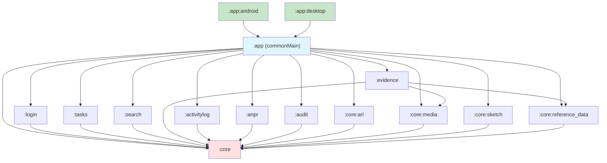
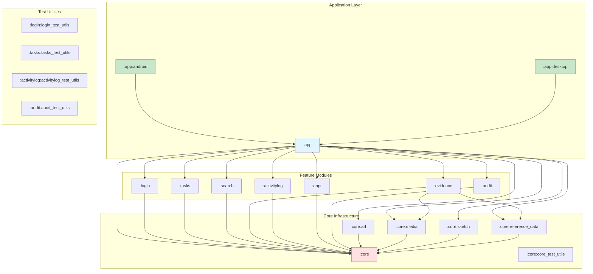

# PSCore Multiplatform - Complete Technical Documentation

**Generated:** 2026-08-18  
**Project Version:** 2026.3.2  
**Documentation Purpose:** Complete technical architecture reference for senior engineers

---

## Table of Contents

1. [Project Overview](#1-project-overview)
2. [Repository Structure](#2-repository-structure)
3. [Gradle & Build Architecture](#3-gradle--build-architecture)
4. [Kotlin Multiplatform Architecture](#4-kotlin-multiplatform-architecture)
5. [Application Architecture](#5-application-architecture)
6. [Dependency Injection](#6-dependency-injection)
7. [Navigation](#7-navigation)
8. [UI Architecture](#8-ui-architecture)
9. [State Management](#9-state-management)
10. [Networking](#10-networking)
11. [Data Layer](#11-data-layer)
12. [Domain Layer](#12-domain-layer)
13. [Error Handling](#13-error-handling)
14. [Concurrency & Coroutines](#14-concurrency--coroutines)
15. [Lifecycle Management](#15-lifecycle-management)
16. [Platform-Specific Architecture](#16-platform-specific-architecture)
17. [External SDKs & Integrations](#17-external-sdks--integrations)
18. [Security](#18-security)
19. [Static Analysis & Code Quality](#19-static-analysis--code-quality)
20. [CI/CD](#20-cicd)
21. [Dependency Graph](#21-dependency-graph)
22. [Threading & Performance Analysis](#22-threading--performance-analysis)
23. [Memory Management](#23-memory-management)
24. [Architecture Strengths](#24-architecture-strengths)
25. [Architecture Weaknesses](#25-architecture-weaknesses)
26. [Recommended Improvements](#26-recommended-improvements)
27. [New Developer Onboarding](#27-new-developer-onboarding)
28. [Technical Glossary](#28-technical-glossary)
29. [Architecture Decision Summary](#29-architecture-decision-summary)
30. [File & Symbol Index](#30-file--symbol-index)
31. [Unknowns & Areas for Verification](#31-unknowns--areas-for-verification)

---

## 1. Project Overview

### 1.1 What the Application Does

**CONFIRMED FROM CODE:**

PSCore (Public Safety Core) is a **Kotlin Multiplatform public safety application** designed for law enforcement, ambulance, and fire services. The application provides:

- **Officer/Resource Management:** Book-on/book-off functionality, duress activation, resource status tracking
- **Task & Incident Management:** CAD (Computer-Aided Dispatch) integration, incident tracking, situational alerts
- **Evidence Management:** Integration with Motorola's Body-Worn Camera (BWC) and In-Car Video (ICV) devices via Evidence Connect SDK
- **Activity Logging:** Comprehensive audit trail of officer activities
- **ANPR (Automatic Number Plate Recognition):** Vehicle identification and tracking
- **Search:** Personnel, incident, and resource search capabilities
- **Audit:** Compliance and audit trail functionality
- **Location Services:** GPS tracking and map integration (Google Maps)
- **Android Auto:** Car app integration for in-vehicle usage

### 1.2 Business Domain

**CONFIRMED FROM CODE:**

The application serves **multiple public safety tenancies**:
- **Police** (multiple variants: police, police1, police.anz)
- **Ambulance**
- **Fire**

Multiple deployment environments are supported:
- **dev, stage, sit, uat, train, prod** (defined in `build-logic/convention/src/main/kotlin/PSCore.kt:66-175`)

Each environment connects to:
- Legacy API Gateway (`pscore-agw-*.pscore.cloud`)
- CPE (Command Central Platform) IDM (`pscore-global-*-idm`)
- APM (Application Performance Monitoring) via OpenTelemetry

### 1.3 Target Platforms

**CONFIRMED FROM CODE:**

1. **Android** (Primary platform)
   - Minimum SDK: 33 (Android 13)
   - Target SDK: 37
   - Compile SDK: 37
   - Supports phone, tablet, Android Auto, widgets

2. **Desktop** (Secondary platform)
   - JVM-based Compose Desktop
   - Target: JVM 17
   - Used for development/testing/administration tools

**NOT CONFIRMED:** iOS support
- iOS source sets are **not** currently configured despite KMP setup
- `iosMain` directories do not exist

### 1.4 KMP/Compose Multiplatform Usage

**CONFIRMED FROM CODE:**

- **Kotlin:** 2.1.0
- **Compose Multiplatform:** 1.8.2
- **Compose Compiler:** 2.1.0 (Kotlin-integrated compose compiler plugin)
- **Multiplatform approach:** `commonMain` + `androidMain` + `desktopMain`
- **All UI is Compose-based** (no XML layouts)

### 1.5 Major Capabilities

**CONFIRMED FROM CODE:**

1. **Authentication:** OAuth2/OIDC integration via AppAuth (Android), multi-tenancy support
2. **Real-time Communication:** WebRTC for video streaming, Firebase Cloud Messaging for push notifications
3. **Offline Capability:** Room database for local persistence, KStore for preferences
4. **Hardware Integration:** BWC/ICV device connectivity, camera integration, biometric authentication
5. **Location Tracking:** Background location services, geofencing (ARL - Activity Recognition Library)
6. **Observability:** OpenTelemetry instrumentation, Firebase Performance/Crashlytics

### 1.6 High-Level Architecture

**CONFIRMED FROM CODE:**

```
┌─────────────────────────────────────────────────────────────┐
│                      App Layer (Multi-tenant)               │
│  ┌──────────┬─────────┬────────┬──────────┬───────┬────── │
│  │ Login    │ Tasks   │ Search │ Evidence │ ANPR  │ Audit │
│  └──────────┴─────────┴────────┴──────────┴───────┴────── │
└────────────────────────┬────────────────────────────────────┘
                         │
┌────────────────────────▼────────────────────────────────────┐
│                     Core Module                             │
│  - Networking (Ktor)                                        │
│  - Persistence (Room, KStore)                               │
│  - Navigation (Navigation3)                                 │
│  - DI (Koin)                                                │
│  - Media (Audio/Video playback)                             │
│  - ARL (Activity Recognition)                               │
│  - Sketch (Drawing/annotation)                              │
└─────────────────────────────────────────────────────────────┘
```

**Architecture Pattern:** Clean Architecture with MVVM + Molecule
- **Presentation:** Compose UI + Molecule Presenters + ViewModels
- **Domain:** Use cases (implicit, not always separate classes)
- **Data:** Repositories + Data sources (Remote/Local)

---

## 2. Repository Structure

### 2.1 Module Organization

**CONFIRMED FROM CODE** (`settings.gradle.kts:35-48`):

The project uses **feature-wise modularization** with the following structure:

```
PSCore-Multiplatform/
├── app/                          # Main application module
│   ├── src/commonMain           # Shared app logic
│   ├── src/androidMain          # Android-specific app code
│   ├── src/desktopMain          # Desktop-specific app code
│   ├── android/                  # Android application target
│   └── desktop/                  # Desktop application target
├── core/                         # Core infrastructure module
│   ├── src/commonMain           # Shared core functionality
│   ├── src/androidMain          # Android-specific core
│   ├── src/desktopMain          # Desktop-specific core
│   ├── arl/                      # Activity Recognition Library
│   ├── media/                    # Media playback
│   ├── reference_data/           # Reference data models
│   ├── sketch/                   # Drawing/annotation
│   └── core_test_utils/          # Core testing utilities
├── login/                        # Authentication feature module
├── tasks/                        # Task/incident management
├── search/                       # Search functionality
├── evidence/                     # Evidence/BWC/ICV integration
├── activitylog/                  # Activity audit logging
├── anpr/                         # ANPR functionality
├── audit/                        # Compliance auditing
├── build-logic/                  # Gradle convention plugins
│   └── convention/src/main/kotlin/
│       ├── PSCore.kt             # Build configuration constants
│       ├── PSCoreLibraryConventionPlugin.kt
│       └── PSCoreRootConventionPlugin.kt
├── gradle/
│   └── libs.versions.toml        # Version catalog
└── buildSrc/                     # Legacy build scripts (mostly unused)
```

### 2.2 Core Module (`:core`)

**Purpose:** Foundation infrastructure shared across all features

**File:** `core/build.gradle.kts`

**Responsibilities:**
- **Networking:** Ktor HTTP client configuration
- **Persistence:** Room database, KStore preferences, Multiplatform Settings
- **Navigation:** Navigation3 integration, ViewModel lifecycle management
- **DI:** Koin module definitions
- **Utilities:** Date/time handling, serialization, logging (Kermit)
- **UI Components:** Reusable Compose components, theme, resources
- **OpenTelemetry:** APM instrumentation

**Dependencies:**
```kotlin
// Confirmed from core/build.gradle.kts:16-45
- Compose Multiplatform (foundation, material3, runtime, resources)
- Navigation3 (runtime, ui) - version 1.1.5
- Lifecycle ViewModel Navigation3 - version 2.11.0
- Koin (core DI)
- Ktor (client, auth, content-negotiation, logging)
- KStore + KStore-file (preferences)
- Kotlinx (coroutines, datetime, serialization)
- Molecule (state management) - version 2.2.0
- Multiplatform Settings
- Kermit (logging)
- Turbine (Flow testing)
- ConstraintLayout Compose Multiplatform
```

**Platform-Specific Dependencies:**
- **androidMain:** 
  - Accompanist Pager
  - AndroidX (Activity Compose, AppCompat, Lifecycle, Window, Work, Car App, DocumentFile)
  - Google Maps (maps, location services)
  - Koin Android
  - Ktor OkHttp engine
  - OpenTelemetry Android
  
- **desktopMain:**
  - AppDirs (platform directories)
  - Koin Compose
  - Ktor OkHttp engine

**Source Sets:**
- `commonMain`: Shared networking, persistence, navigation, DI, utilities
- `androidMain`: Android-specific implementations (OpenTelemetry, Google Maps, Car App)
- `desktopMain`: Desktop-specific implementations (file system access)
- `commonTest`: Shared tests
- `androidUnitTest`: Android unit tests (Truth, JUnit Jupiter, MockK)

### 2.3 Core Sub-modules

#### 2.3.1 `:core:core_test_utils`

**Purpose:** Shared testing utilities and mock implementations

**CONFIRMED:** Used across all feature modules for testing

#### 2.3.2 `:core:reference_data`

**Purpose:** Reference data models (likely enums, constants, lookup data)

**NEEDS_VERIFICATION:** Actual contents and purpose

#### 2.3.3 `:core:arl` (Activity Recognition Library)

**Purpose:** Background activity detection and location tracking

**CONFIRMED FROM CODE:** (`app/android/src/main/AndroidManifest.xml:179-188`)
- Foreground service for location tracking
- Activity detection broadcast receiver
- Service type: `location`

#### 2.3.4 `:core:sketch`

**Purpose:** Drawing and annotation capabilities

**INFERRED:** Likely uses AndroidX Ink libraries for stylus/touch input

#### 2.3.5 `:core:media`

**Purpose:** Audio/video playback infrastructure

**CONFIRMED:** Separate module for media handling

### 2.4 Feature Modules

#### 2.4.1 `:login`

**File:** `login/build.gradle.kts`

**Purpose:** Authentication and authorization

**Responsibilities:**
- OAuth2/OIDC authentication flow
- Device registration
- User profile management
- Mobile config fetching
- Feature flag initialization
- Reference data synchronization

**Dependencies:**
```kotlin
- project(":core")
- Compose Multiplatform
- Navigation3
- Koin
- Ktor (auth, serialization)
- KStore
- Molecule
- Multiplatform Settings
- AppAuth (Android) - OAuth2 library
- AndroidX Browser (Custom Tabs for OAuth)
```

**Platform-Specific:**
- **androidMain:** AppAuth integration, Custom Tabs for OAuth
- **desktopMain:** Desktop authentication flow (NEEDS_VERIFICATION)

**Test Utilities:** `:login:login_test_utils` module available

#### 2.4.2 `:tasks`

**Purpose:** Task and incident management (CAD integration)

**CONFIRMED FROM CODE:** (`app/android/src/main/AndroidManifest.xml:154-176`)

**Broadcast Receivers:**
- `IncidentBroadcastReceiver`
- `SituationalAlertBroadcastReceiver`
- `CadStateBroadcastReceiver`
- `ResourceBroadcastReceiver`

**INFERRED:** Real-time CAD updates via broadcast mechanism

**Test Utilities:** `:tasks:tasks_test_utils` available

#### 2.4.3 `:evidence`

**File:** `evidence/build.gradle.kts`

**Purpose:** Body-Worn Camera (BWC) and In-Car Video (ICV) integration

**Key Dependencies:**
```kotlin
- project(":core")
- project(":core:media")
- project(":core:reference_data")
- Evidence Connect SDK:
  - libs.evidence.connect.bwc (version 26.3.0-hotfix1)
  - libs.evidence.connect.icv (version 26.3.0-hotfix1)
- CameraX (camera2, lifecycle, mlkit-vision, view)
- MLKit Barcode Scanning
- WebRTC KMP
- Media3 ExoPlayer (HLS, RTSP, DASH, UI)
- Haze (Material blur effects)
```

**Android Components:** (`app/android/src/main/AndroidManifest.xml:67-110`)
- `FullScreenStreamingActivity` - Landscape video streaming
- `EvidenceConnectionForegroundService` - BWC/ICV connectivity (foreground service type: `connectedDevice`)
- `EvidenceNotificationActionReceiver` - Notification actions (try again, cancel, disconnect, dismiss)
- `PipActionBroadcastReceiver` - Picture-in-Picture video controls

**Responsibilities:**
- Device discovery and pairing (BWC/ICV)
- Video streaming (WebRTC)
- Video playback (ExoPlayer with HLS/RTSP/DASH support)
- QR code scanning for device pairing
- Evidence metadata management
- Foreground service for persistent device connection

#### 2.4.4 `:search`

**Purpose:** Search functionality for personnel, incidents, resources

**NEEDS_VERIFICATION:** API integration details

#### 2.4.5 `:activitylog`

**Purpose:** Activity audit logging

**CONFIRMED:** OpenAPI-generated models (`build.gradle.kts:108-127`)
- API specification: `api/core-activity-log.yml`
- Generated models: `au.com.motorolasolutions.pscore.activitylog.api.models`

**Test Utilities:** `:activitylog:activitylog_test_utils` available

#### 2.4.6 `:anpr`

**Purpose:** Automatic Number Plate Recognition

**NEEDS_VERIFICATION:** Integration with camera/device APIs

#### 2.4.7 `:audit`

**Purpose:** Compliance and audit trail functionality

**Test Utilities:** `:audit:audit_test_utils` available

### 2.5 App Module (`:app`)

**File:** `app/build.gradle.kts`

**Purpose:** Application orchestration, dependency aggregation, screens, navigation

**Dependencies on ALL feature modules:**
```kotlin
implementation(project(":core"))
implementation(project(":core:reference_data"))
implementation(project(":core:arl"))
implementation(project(":core:sketch"))
implementation(project(":core:media"))
implementation(project(":login"))
implementation(project(":search"))
implementation(project(":tasks"))
implementation(project(":activitylog"))
implementation(project(":anpr"))
implementation(project(":audit"))
implementation(project(":evidence"))
```

**Additional Capabilities:**
- Room database (version 2.8.4) with KSP code generation
- Material Kolor (dynamic color theming)
- BuildKonfig for build-time configuration

**Platform Targets:**
- `:app:android` - Android application
- `:app:desktop` - Desktop application

**Screens:** (`app/src/commonMain/kotlin/au/com/motorolasolutions/pscore/app/screens/`)
- `RootScreen` - Application entry point
- `MainScreen` - Main navigation container
- `LoginScreen` - Authentication
- `SettingsScreen` - Configuration
- `AppVersionScreen` - Version checking
- `DeviceCompromisedScreen` - Security warnings
- `LocationServicesScreen` - Location permission
- `PermissionScreen` - Runtime permissions
- Book-on screens (duress, traffic stop, resource)
- Login substeps (mobile config, feature flags, device registration, reference data, fetch officer, user persistence)

### 2.6 Build Logic (`:build-logic`)

**File:** `build-logic/convention/src/main/kotlin/PSCoreLibraryConventionPlugin.kt`

**Purpose:** Gradle convention plugins for consistent module configuration

**PSCoreLibraryConventionPlugin:**
- Supports two modes:
  1. **KMP Library (default):** `kotlin.multiplatform` + `com.android.library`
  2. **Android Application:** If `com.android.application` is pre-applied, uses `kotlin.android`

**Applied Plugins:**
- Kotlin Multiplatform
- Kotlin Serialization
- Kotlin Parcelize
- Kotlin Compose Compiler
- Android Library
- Kover (code coverage)
- Detekt (static analysis)

**Compiler Configuration:**
- JVM Toolchain: 17
- JVM Target: 17
- Free compiler args: `-opt-in=kotlin.time.ExperimentalTime`

**Android Configuration:**
- Compile SDK: 37
- Min SDK: 33
- Source/Target Java: 17
- Compose: Enabled
- Non-transitive R classes: Enabled
- Test options: Return default values for unit tests

**Targets:**
- `androidTarget` - Android platform
- `jvm("desktop")` - Desktop platform

**Detekt Baseline Management:**
- Separate baseline files for Android (`detekt-baseline-android.xml`) to avoid conflicts with `commonMain` baselines

**PSCore Configuration Object:** (`build-logic/convention/src/main/kotlin/PSCore.kt`)
- Version: 2026.3.2
- Package: `au.com.motorolasolutions.pscore`
- Firebase Project: `melbourne-design-center-pscore`
- Endpoints (dev, stage, sit, uat, train, prod) with:
  - Legacy URL
  - CPE URL and realm
  - APM URL and environment
  - App version endpoint
  - Client configurations per tenancy
- Clients: Multi-tenancy support (police, police1, police.anz, ambulance, fire) with OAuth2 client credentials per environment

### 2.7 Module Dependency Diagram



---

## 3. Gradle & Build Architecture

### 3.1 Settings & Repository Configuration

**File:** `settings.gradle.kts`

**Repository Configuration:**
```kotlin
// Confirmed from settings.gradle.kts:3-14, 18-29
repositories {
  google()          // Android libraries
  mavenCentral()    // Standard Kotlin/JVM libraries
  maven("https://maven.pkg.jetbrains.space/public/p/compose/dev")  // Compose dev builds
  maven("https://maven.pkg.github.com/msicie/mex-mobile_kotlin") {  // Proprietary Evidence Connect SDK
    credentials {
      username = cieAccountUsername  // From local.properties
      password = cieAccountPassword  // From local.properties
    }
  }
}
```

**SECURITY NOTE:** Evidence Connect SDK requires GitHub package authentication via `local.properties`

### 3.2 Version Catalog

**File:** `gradle/libs.versions.toml`

**Key Versions:**
```toml
[versions]
agp = "9.1.0"                          # Android Gradle Plugin
kotlin = "2.1.0"                       # Kotlin
compose-multiplatform = "1.8.2"        # Compose Multiplatform
navigation3 = "1.1.5"                  # Navigation3
lifecycle-viewmodel-navigation3 = "2.11.0"
koin = "4.0.1"                         # Dependency Injection
koin-compose = "4.0.4"
ktor = "3.5.0"                         # Networking
kotlinx-coroutines = "1.10.2"
kotlinx-datetime = "0.7.1"
kotlinx-serialization = "1.7.3"
molecule = "2.2.0"                     # State management
room = "2.8.4"                         # Local database
ksp = "2.2.21-2.0.5"                   # Kotlin Symbol Processing
kover = "0.9.1"                        # Code coverage
detekt = "1.23.6"                      # Static analysis
evidenceConnect = "26.3.0-hotfix1"     # Motorola Evidence Connect SDK
firebase-android-bom = "33.4.0"
opentelemetry-android = "1.2.0-alpha"
webrtc-kmp = "0.125.7"
media3-exoplayer = "1.4.1"
androidx-compose = "1.8.1"
androidx-lifecycle= "2.8.7"
camerax = "1.4.2"
```

**AGP 9.0 Compatibility Workarounds:** (`gradle.properties:99-106`)
```properties
android.newDsl=false           # Temporarily disabled for AGP 9.0 compatibility
android.builtInKotlin=false
android.uniquePackageNames=false
```

**RISK:** These settings will be removed in AGP 10.0 (expected 2026). Migration required.

### 3.3 Gradle Properties & Performance

**File:** `gradle.properties`

**JVM Configuration:**
```properties
org.gradle.jvmargs=-Xmx16g -Xms4g -XX:MaxMetaspaceSize=2g 
  -XX:+UseG1GC -XX:G1HeapRegionSize=16m 
  -XX:+ParallelRefProcEnabled 
  -XX:ReservedCodeCacheSize=512m 
  -XX:+HeapDumpOnOutOfMemoryError 
  -Dfile.encoding=UTF-8
```

**CONFIRMED:** Large heap allocation (16GB) indicates complex multiplatform build requirements

**Performance Optimizations:**
```properties
org.gradle.parallel=true
org.gradle.caching=true
org.gradle.daemon=true
org.gradle.vfs.watch=true                     # File system watching
org.gradle.configuration-cache=true            # Configuration cache (Gradle 8.1+)
org.gradle.configuration-cache.parallel=true
org.gradle.tooling.parallel=true              # Gradle 9.4+
kotlin.incremental=true
kotlin.incremental.multiplatform=true
kotlin.compiler.execution.strategy=daemon
```

**KMP-Specific Settings:**
```properties
kotlin.mpp.androidSourceSetLayoutVersion=2     # New source set layout
kotlin.mpp.enableCInteropCommonization=true
kotlin.mpp.stability.nowarn=true
kotlin.native.binary.memoryModel=experimental
kotlin.native.cacheKind=static
import_orphan_source_sets=false
```

**Android Optimizations:**
```properties
android.useAndroidX=true
android.nonTransitiveRClass=true               # Faster R class generation
```

### 3.4 Root Build File

**File:** `build.gradle.kts`

**Applied Plugins:**
```kotlin
plugins {
  alias(libs.plugins.openapi.generator)
  alias(libs.plugins.sonarqube)
  id("pscore.root")
}
```

**SonarQube Configuration:**
- Source encoding: UTF-8
- Source directories: All `commonMain` and `androidMain` Kotlin sources
- Test directories: `commonTest` and `androidUnitTest`
- Coverage: Kover XML reports (`app/build/reports/kover/reportDebug.xml`)

**OpenAPI Generation:**
- Input: `api/core-activity-log.yml`
- Output: `build/generated/openapi`
- Generator: `kotlin` with `multiplatform` library
- Package: `au.com.motorolasolutions.pscore.activitylog.api.models`
- Date library: `kotlinx-datetime`

**CONFIRMED:** Activity Log uses OpenAPI-generated client models

### 3.5 BuildKonfig (Build-Time Configuration)

**Used in:**
- `:core` (MAP_API_KEY for Google Maps)
- `:app` (VERSION, APP_CONFIG_VERSION, IS_DEBUG, BUILD_FLAVOR, IS_PROD, PACKAGE_NAME, APP_VERSION_ENDPOINT)
- `:login` (LEGACY_ACCESS_KEY, DEFAULT_ACCESS_KEY)

**Build Flavor Detection:** (`app/build.gradle.kts:140-158`)
```kotlin
val buildFlavor: PSCore.Flavour = 
  gradleProperty("pscore.flavor") ?: 
  taskName.contains("dev", "stage", "sit", "uat", "train", "prod") ?: 
  PSCore.Flavour.PROD

val isDebug = 
  gradleProperty("pscore.debug").toBoolean() || 
  taskName.contains("Debug")
```

**Package Name Logic:**
- Prod: `au.com.motorolasolutions.pscore`
- Non-prod: `au.com.motorolasolutions.pscore.{flavor}` (e.g., `.dev`, `.stage`)

### 3.6 Compiler Configuration

**Kotlin Compiler Options:** (`PSCoreLibraryConventionPlugin.kt:69-76`)
```kotlin
compilerOptions {
  freeCompilerArgs.add("-opt-in=kotlin.time.ExperimentalTime")
}
androidTarget {
  compilerOptions {
    jvmTarget.set(JvmTarget.JVM_17)
  }
}
jvm("desktop") {
  compilerOptions {
    jvmTarget.set(JvmTarget.JVM_17)
  }
}
```

**Compose Compiler:** Integrated with Kotlin 2.1.0 (no separate plugin version)

### 3.7 Build Types, Flavors, and Variants

**NEEDS_VERIFICATION:** Android-specific build types and product flavors

**INFERRED FROM BUILD LOGIC:**
- Flavors: dev, stage, sit, uat, train, prod (defined in `PSCore.Flavour`)
- Build types: debug, release (standard Android)
- Likely structure: `{flavor}{BuildType}` (e.g., `devDebug`, `prodRelease`)

**Flavor-Specific Android Modules:** (`app/android/src/{flavor}/kotlin/`)
- `dev/AndroidFlavorModule.kt`
- `stage/AndroidFlavorModule.kt`
- `sit/AndroidFlavorModule.kt`
- `uat/AndroidFlavorModule.kt`
- `train/AndroidFlavorModule.kt`
- `prod/AndroidFlavorModule.kt`

**PURPOSE:** Flavor-specific Koin modules for environment-specific dependencies

### 3.8 ProGuard/R8

**NEEDS_VERIFICATION:** ProGuard rules location and configuration

**LIKELY:** `app/android/proguard-rules.pro` (standard location)

### 3.9 Signing Configuration

**CONFIRMED:** Keystore location: `app/keys/` directory exists

**NEEDS_VERIFICATION:** Actual signing configuration in Android Gradle files

### 3.10 Resource Management

**Compose Resources:**
```kotlin
compose.resources {
  publicResClass = true  // Generate public resource classes
}
```

**Resource Directories:**
- `{module}/src/commonMain/composeResources/` - Multiplatform resources
- `{module}/src/commonMain/resources/` - Added as Kotlin source dir
- `app/android/src/main/res/` - Android-specific resources

**Localization:** (`login/src/commonMain/composeResources/`)
- `values` (default)
- `values-de-rDE` (German)
- `values-pt-rBR` (Portuguese)
- `values-es` (Spanish)

### 3.11 Code Generation

**Room Database:** (`app/build.gradle.kts:175-177`)
```kotlin
room {
  schemaDirectory("$projectDir/schemas")  // Schema export directory
}
dependencies {
  add("kspAndroid", libs.room.compiler)
  add("kspDesktop", libs.room.compiler)
}
```

**CONFIRMED:** Room schemas are exported and versioned in `app/schemas/`

**OpenAPI Generator:** Activity Log API models auto-generated

**KSP Configuration:**
- Version: 2.2.21-2.0.5 (Kotlin 2.0.5 compatible)
- Used for Room, potentially other annotation processors

### 3.12 Build Flow Summary

```
┌─────────────────────────────────────────────────────────────┐
│ 1. Apply PSCore convention plugins                         │
│    - Configure Kotlin Multiplatform                         │
│    - Configure Android Library/Application                  │
│    - Apply Compose, Serialization, Parcelize, Kover, Detekt│
└──────────────────────┬──────────────────────────────────────┘
                       │
┌──────────────────────▼──────────────────────────────────────┐
│ 2. Generate BuildKonfig constants                          │
│    - Flavor detection                                       │
│    - Version information                                    │
│    - API endpoints                                          │
└──────────────────────┬──────────────────────────────────────┘
                       │
┌──────────────────────▼──────────────────────────────────────┐
│ 3. Run KSP processors                                       │
│    - Room database code generation                          │
└──────────────────────┬──────────────────────────────────────┘
                       │
┌──────────────────────▼──────────────────────────────────────┐
│ 4. Compile Kotlin (commonMain → androidMain → desktopMain) │
└──────────────────────┬──────────────────────────────────────┘
                       │
┌──────────────────────▼──────────────────────────────────────┐
│ 5. Run Detekt (static analysis)                            │
└──────────────────────┬──────────────────────────────────────┘
                       │
┌──────────────────────▼──────────────────────────────────────┐
│ 6. Package (APK/AAB for Android, JAR for Desktop)         │
└─────────────────────────────────────────────────────────────┘
```

---

## 4. Kotlin Multiplatform Architecture

### 4.1 Source Set Structure

**CONFIRMED FROM CODE:**

All feature modules and `:core` follow this structure:

```
{module}/
├── src/
│   ├── commonMain/kotlin/       # Shared Kotlin code
│   ├── commonTest/kotlin/       # Shared tests
│   ├── androidMain/kotlin/      # Android-specific implementations
│   ├── androidUnitTest/kotlin/  # Android unit tests
│   ├── desktopMain/kotlin/      # Desktop-specific implementations
│   └── desktopTest/kotlin/      # Desktop tests
```

**NO iOS Support:** `iosMain` directories do not exist

### 4.2 Shared Code (`commonMain`)

**What is Shared:**

1. **Business Logic:**
   - ViewModels/Presenters (Molecule)
   - Use cases (when present)
   - Domain models
   - State management

2. **UI:**
   - All Compose UI (screens, components)
   - Navigation (Navigation3)
   - Theming

3. **Networking:**
   - Ktor HTTP client setup
   - API interfaces
   - Request/response models

4. **Data Layer:**
   - Repository interfaces and implementations
   - Data models
   - Serialization logic

5. **Persistence:**
   - Room database definitions (entities, DAOs, database class)
   - KStore usage
   - Multiplatform Settings

**Percentage of Shared Code:** ESTIMATED ~85-90% (most logic is in `commonMain`)

### 4.3 Platform-Specific Code

#### 4.3.1 `androidMain`

**Android-Specific Implementations:**

1. **Networking:**
   - Ktor OkHttp engine

2. **DI:**
   - Koin Android modules
   - Android ViewModel integration

3. **Persistence:**
   - Room platform driver
   - AndroidX Security Crypto (encrypted preferences)

4. **UI:**
   - Android-specific composables (Accompanist Pager)
   - Lifecycle integration
   - Window size classes

5. **Platform APIs:**
   - Google Maps integration
   - Android Auto (Car App)
   - Location services (Fused Location Provider)
   - Camera (CameraX)
   - Biometric authentication
   - Work Manager
   - Firebase (Crashlytics, Analytics, Performance, Messaging)
   - OpenTelemetry instrumentation

6. **Evidence:**
   - Evidence Connect SDK (BWC/ICV)
   - WebRTC
   - Media3 ExoPlayer

#### 4.3.2 `desktopMain`

**Desktop-Specific Implementations:**

1. **Networking:**
   - Ktor OkHttp engine

2. **DI:**
   - Koin Compose integration

3. **File System:**
   - AppDirs (platform-specific application directories)

4. **Persistence:**
   - Room JVM driver
   - Desktop file-based KStore

**OBSERVATION:** Desktop implementation is minimal compared to Android

### 4.4 `expect`/`actual` Usage

**CONFIRMED FROM CODE:** (`core/src/commonMain/kotlin/`)

#### 4.4.1 Platform Module

**File:** `core/src/commonMain/kotlin/au/com/motorolasolutions/pscore/core/CoreModules.kt`

```kotlin
expect val platformModule : Module
```

**Purpose:** Platform-specific Koin module

**Actual Implementations:**
- `core/src/androidMain/kotlin/.../core/CoreModules.kt` → Android platform module
- `core/src/desktopMain/kotlin/.../core/CoreModules.kt` → Desktop platform module

**Why Platform-Specific:** Provides platform-specific dependencies (e.g., Android Context, file system access, platform APIs)

#### 4.4.2 Locale

**File:** `core/src/commonMain/kotlin/.../core/resources/Locale.kt`

```kotlin
expect class Locale
expect val Locale.name: String
expect fun getLocale(name: String): Locale
expect fun getDefaultLocale(): Locale
```

**Purpose:** Localization/internationalization

**Why Platform-Specific:** Each platform has different locale APIs (Android: `java.util.Locale`, Desktop: JVM `Locale`)

#### 4.4.3 Permissions

**File:** `core/src/commonMain/kotlin/.../core/providers/PermissionsHandler.kt`

```kotlin
expect interface Permission
expect val Permission.text: String @Composable get
expect val Permission.icon: ImageVector
expect val listOfAppPermission: List<Permission>
```

**Purpose:** Runtime permission handling

**Why Platform-Specific:** 
- Android has runtime permission system
- Desktop may have different or no permission requirements

#### 4.4.4 Localizable Resolver

**File:** `core/src/commonMain/kotlin/.../core/resources/LocalizableResolver.kt`

```kotlin
expect fun <T> Localizable<T>.localised(): T
```

**Purpose:** Resolve localized resources

**Why Platform-Specific:** Resource loading differs by platform

**NEEDS_VERIFICATION:** Full list of `expect`/`actual` declarations

**LIKELY ADDITIONAL `expect`/`actual`:**
- File I/O
- Biometric authentication
- Cryptography
- Platform-specific UI components
- Background services
- Push notifications

### 4.5 Dependency Boundaries

**CONFIRMED FROM CODE:**

```
┌──────────────────────────────────────────────────────────┐
│                     commonMain                            │
│  - Can ONLY depend on:                                   │
│    • Other commonMain modules                            │
│    • Kotlin stdlib                                       │
│    • Kotlinx libraries (coroutines, datetime, etc.)      │
│    • Multiplatform libraries (Ktor, Koin, Compose, etc.)│
│  - CANNOT depend on:                                     │
│    • Platform-specific libraries (Android SDK,[Blueprint.kt](../../../../Users/WHKQ63/Desktop/Blueprint.kt) etc.)     │
└──────────────────────────────────────────────────────────┘
                          │
         ┌────────────────┴────────────────┐
         │                                 │
┌────────▼─────────┐            ┌─────────▼────────┐
│   androidMain    │            │   desktopMain    │
│  - Can depend on:│            │  - Can depend on:│
│    • commonMain  │            │    • commonMain  │
│    • Android SDK │            │    • JVM stdlib  │
│    • Android libs│            │    • JVM libs    │
└──────────────────┘            └──────────────────┘
```

**Strict Enforcement:** Kotlin compiler enforces these boundaries

### 4.6 KMP Migration Status

**Current State:**
- ✅ All feature modules are KMP-ready (commonMain/androidMain/desktopMain structure)
- ✅ Core infrastructure is fully multiplatform
- ✅ UI is 100% Compose (no Android Views)
- ✅ Networking is platform-agnostic (Ktor)
- ✅ DI is platform-agnostic (Koin)
- ❌ iOS support is not implemented
- ⚠️ Desktop support exists but is minimal (likely for internal tools only)

**Android-Centric Reality:**
- Despite KMP architecture, the project is **primarily an Android application**
- Desktop target is secondary (testing/tooling)
- iOS is not a target (no source sets)

---


## 5. Application Architecture

### 5.1 Architectural Pattern

**CONFIRMED FROM CODE:** The application uses **Clean Architecture + MVVM + Molecule**

#### Architecture Layers:

```
┌─────────────────────────────────────────────────────────────┐
│                  Presentation Layer                         │
│  ┌──────────────┬───────────────┬──────────────────────────│
│  │ Composables  │  ViewModels   │  Molecule Presenters     │
│  │ (UI)         │  (Lifecycle)  │  (@Composable Domain)    │
│  └──────────────┴───────────────┴──────────────────────────│
└────────────────────────┬────────────────────────────────────┘
                         │
┌────────────────────────▼────────────────────────────────────┐
│                   Domain Layer (Implicit)                   │
│  - Use Cases (often inline in ViewModels)                  │
│  - Business Logic                                           │
│  - Domain Models                                            │
└────────────────────────┬────────────────────────────────────┘
                         │
┌────────────────────────▼────────────────────────────────────┐
│                      Data Layer                             │
│  ┌──────────────┬──────────────┬────────────────────────── │
│  │ Repositories │  Data Sources │  Mappers                 │
│  └──────────────┴──────────────┴────────────────────────── │
└────────────────────────┬────────────────────────────────────┘
                         │
         ┌───────────────┴───────────────┐
         │                               │
┌────────▼─────────┐          ┌─────────▼──────────┐
│  Remote Sources  │          │  Local Sources     │
│  (Ktor HTTP)     │          │  (Room, KStore)    │
└──────────────────┘          └────────────────────┘
```

### 5.2 ViewModel + Molecule Pattern

**CONFIRMED FROM CODE:** (`app/src/commonMain/kotlin/au/com/motorolasolutions/pscore/app/screens/root/RootViewModel.kt`)

The project uses a **unique ViewModel + Molecule integration**:

#### ViewModel (Lifecycle Owner)

```kotlin
class RootViewModel : ViewModel(), KoinComponent {
  private val events: EventsFlow<RootScreenEvent> = EventsFlow()
  private val officerRepository: CadOfficerRepository by inject()
  // ... other dependencies injected via Koin
  
  private val initialState: RootState = RootState(...)
  
  // Molecule integration: moleculeStateIn converts @Composable to StateFlow
  val states: StateFlow<RootState> = moleculeStateIn(
    sharingStarted = SharingStarted.Lazily,
    initialState = initialState,
    domain = { RootDomain(...) }  // Calls @Composable presenter
  )
  
  // Event handlers
  fun onDismissAlert() {
    viewModelScope.launch { events.emit(RootScreenEvent.OnDismissAlert) }
  }
}
```

#### Molecule Presenter (@Composable Domain)

**File:** `app/src/commonMain/kotlin/au/com/motorolasolutions/pscore/app/screens/root/RootDomain.kt`

```kotlin
@Composable
fun RootDomain(
  initialState: RootState,
  officerRepository: CadOfficerRepository,
  syncRepository: SyncRepository,
  // ... all dependencies passed explicitly
  events: EventsFlow<RootScreenEvent>,
): RootState {
  // Collect flows as Compose State
  val resourceDetails: ResourceDetails? by resourceRepository.updates.collectAsState(Loading)
  val officerStatus: OfficerStatus? by officerRepository.updates.collectAsState(Loading)
  val networkStatus: NetworkStatus by networkListener.updates.collectAsState()
  val recordingState: RecordingState by evidenceRecordingService.state.collectAsState()
  
  // Compose state management
  var currentState by remember { mutableStateOf(initialState) }
  
  // React to events
  LaunchedEffect(Unit) {
    events.collect { event ->
      when (event) {
        OnDismissAlert -> currentState = currentState.copy(showAlert = false)
        OnDisconnect -> // handle disconnect
      }
    }
  }
  
  // Derive UI state from multiple sources
  currentState = currentState.copy(
    isOnline = networkStatus == NetworkStatus.Online,
    isRecording = recordingState is RecordingState.Recording,
    callSign = officerStatus?.callSign
  )
  
  return currentState
}
```

**WHY THIS PATTERN:**
- **ViewModel:** Provides lifecycle-scoped coroutine scope (`viewModelScope`)
- **Molecule:** Enables reactive UI state composition using Compose APIs
- **Benefit:** Write state management logic using familiar Compose patterns (collectAsState, LaunchedEffect, remember) but expose as StateFlow to UI
- **`moleculeStateIn`:** Converts `@Composable` function to `StateFlow<State>`

### 5.3 Data Flow Architecture

**CONFIRMED PATTERN:**

```
┌─────────────────────────────────────────────────────────────┐
│ User Action (Button Click)                                 │
└──────────────────────┬──────────────────────────────────────┘
                       │
┌──────────────────────▼──────────────────────────────────────┐
│ Composable calls ViewModel method                          │
│ Example: onClick = { viewModel.onDismissAlert() }          │
└──────────────────────┬──────────────────────────────────────┘
                       │
┌──────────────────────▼──────────────────────────────────────┐
│ ViewModel emits event to EventsFlow                        │
│ viewModelScope.launch { events.emit(OnDismissAlert) }      │
└──────────────────────┬──────────────────────────────────────┘
                       │
┌──────────────────────▼──────────────────────────────────────┐
│ Molecule Presenter receives event via LaunchedEffect       │
│ events.collect { event -> /* handle */ }                   │
└──────────────────────┬──────────────────────────────────────┘
                       │
┌──────────────────────▼──────────────────────────────────────┐
│ Presenter updates state                                     │
│ currentState = currentState.copy(showAlert = false)         │
└──────────────────────┬──────────────────────────────────────┘
                       │
┌──────────────────────▼──────────────────────────────────────┐
│ New state returned, moleculeStateIn emits to StateFlow     │
└──────────────────────┬──────────────────────────────────────┘
                       │
┌──────────────────────▼──────────────────────────────────────┐
│ Composable observes StateFlow and recomposes               │
│ val state by viewModel.states.collectAsState()             │
└─────────────────────────────────────────────────────────────┘
```

### 5.4 Repository Pattern

**CONFIRMED:** Standard repository pattern with Flow-based updates

**Example:** `CadOfficerRepository`, `SyncRepository`, `ResourceRepository`

```kotlin
interface Repository<T> {
  val updates: Flow<T?>  // Reactive updates
  val cached: T?         // Synchronous cached value
  
  suspend fun get(): T?
  suspend fun update(value: T)
}
```

### 5.5 Use Cases

**OBSERVATION:** Use cases are **NOT always separate classes**

**Pattern 1:** Inline in ViewModel/Presenter (most common)
```kotlin
// Business logic directly in presenter
LaunchedEffect(officerStatus) {
  if (officerStatus?.status == Status.OnDuty) {
    arl.start()  // Start activity recognition
  }
}
```

**Pattern 2:** Separate Manager classes (complex logic)
- `AuthManager` (login module)
- `AuditManager` (audit module)
- `MobileConfigManager` (app module)

**WHY:** Pragmatic approach - simple logic stays inline, complex/reusable logic extracted

### 5.6 Dependency Injection with Koin

**File:** `app/src/commonMain/kotlin/au/com/motorolasolutions/pscore/app/AppModules.kt`

```kotlin
val appModules: List<Module> = listOf(
  appDataModule, 
  appApiModule, 
  httpClientModule
)
```

**Module Structure:**
- `appDataModule` - Data repositories, stores
- `appApiModule` - API services
- `httpClientModule` - Ktor HTTP client configuration

**ViewModel Integration:**
```kotlin
class RootViewModel : ViewModel(), KoinComponent {
  private val officerRepository: CadOfficerRepository by inject()
  private val syncRepository: SyncRepository by inject()
  private val credentialsStore: KStore<DeviceCredentials> by inject(named(CREDENTIALS))
  // ... dependencies injected via Koin `by inject()`
}
```

**IMPORTANT:** ViewModels use `KoinComponent` interface for manual DI (not constructor injection)

### 5.7 State Classes

**PATTERN:** Immutable data classes with `copy()` for updates

```kotlin
data class RootState(
  val screens: RootScreens,
  val featureFlagSettings: FeatureFlagSettings,
  val isOnline: Boolean = true,
  val showAlert: Boolean = false,
  val callSign: Callsign? = null,
  val isRecording: Boolean = false,
  val untaggedCount: Int = 0
)
```

### 5.8 Event Handling

**PATTERN:** EventsFlow for one-time events (not state)

```kotlin
class EventsFlow<T> {
  private val _events = MutableSharedFlow<T>()
  val events: SharedFlow<T> = _events.asSharedFlow()
  
  suspend fun emit(event: T) = _events.emit(event)
}
```

**Usage:**
- **State changes:** Use StateFlow (e.g., loading, data, errors that persist)
- **One-time events:** Use EventsFlow (e.g., navigation, toasts, dialogs)

---

## 6. Dependency Injection

### 6.1 DI Framework

**CONFIRMED:** Koin 4.0.1 (core), 4.0.4 (compose)

**WHY KOIN:**
- Kotlin-native
- Multiplatform support
- Simple DSL
- No code generation
- Runtime DI (vs. compile-time like Dagger/Hilt)

### 6.2 Module Structure

**Hierarchical Module Organization:**

```
┌──────────────────────────────────────────────────────────┐
│ App-Level Modules (app/src/commonMain/.../AppModules.kt)│
│  - appDataModule                                         │
│  - appApiModule                                          │
│  - httpClientModule                                      │
│  - + All feature modules                                 │
└────────────────────────┬─────────────────────────────────┘
                         │
         ┌───────────────┴───────────────┐
         │                               │
┌────────▼─────────────┐     ┌──────────▼──────────────────┐
│ Core Module          │     │ Feature Modules             │
│  - platformModule    │     │  - loginDataModule          │
│  - coreDataModule    │     │  - tasksDataModule          │
│  - coreApiModule     │     │  - searchDataModule         │
└──────────────────────┘     │  - evidenceDataModule       │
                             │  - activityLogDataModule    │
                             │  - anprDataModule           │
                             │  - auditDataModule          │
                             └─────────────────────────────┘
```

### 6.3 Platform-Specific Modules

**File:** `core/src/commonMain/kotlin/.../core/CoreModules.kt`

```kotlin
expect val platformModule : Module
```

**Android Implementation:** `core/src/androidMain/kotlin/.../core/CoreModules.kt`
```kotlin
actual val platformModule = module {
  single<Context> { androidContext() }
  single<HttpClientEngine> { OkHttp.create() }
  // Android-specific dependencies
}
```

**Desktop Implementation:** `core/src/desktopMain/kotlin/.../core/CoreModules.kt`
```kotlin
actual val platformModule = module {
  single<HttpClientEngine> { OkHttp.create() }
  // Desktop-specific dependencies
}
```

### 6.4 HTTP Client Module

**File:** `app/src/commonMain/kotlin/.../app/api/HttpClientModule.kt`

**CONFIRMED FROM CODE:** Sophisticated Ktor HTTP client with:

```kotlin
val httpClientModule: Module = module {
  single<HttpClient> {
    HttpClient(get<HttpClientEngine>()) {
      // 1. Logging
      install(Logging) {
        level = LogLevel.ALL
        sanitizeHeader { it == HttpHeaders.Authorization }
      }
      
      // 2. Content Negotiation (JSON)
      install(ContentNegotiation) { 
        json(get<Json>()) 
      }
      
      // 3. OAuth2 Bearer Token Auth
      Auth {
        bearer {
          loadTokens { /* load from KStore */ }
          refreshTokens { /* call authManager.refreshToken() */ }
        }
      }
      
      // 4. Default Request Headers
      defaultRequest {
        host = endpointProvider.get()
        url { protocol = URLProtocol.HTTPS }
        header("X-Session-ID", Uuid.random())
        header("pscore-app-version", BuildKonfig.APP_CONFIG_VERSION)
        header("X-Platform", DeviceProvider.os)
        header("X-Device-Type", DeviceProvider.model)
        header("X-Device-Manufacturer", DeviceProvider.manufacturer)
      }
      
      // 5. Per-Request Headers
      eachRequest {
        header("X-Transaction-ID", Uuid.random())
        header("X-Device-ID", credentials.deviceId)
        header("X-Tenancy-ID", tenancy)
        header("X-User-ID", employeeNumber)
        header("X-Callsign", callSign)
      }
      
      // 6. Timeout
      install(HttpTimeout) {
        requestTimeoutMillis = 60000  // 60 seconds
      }
      
      // 7. Custom Plugin: Remove Emojis
      install(RemoveEmojiPlugin)
      
      // 8. OpenTelemetry Tracing
      install(KtorTelemetryPlugin) {
        telemetryProvider = get()
        customAttributeExtractor = { request ->
          // Extract device ID, tenancy, user, transaction ID, session ID
        }
      }
      
      // 9. Audit Logout Interceptor
      install(createClientPlugin("AuditCheckPlugin") {
        onRequest { request, _ ->
          if (request.url.endsWith("/deregister")) {
            // Wait for pending audits (max 10 seconds)
            while (auditManager.hasPendingAudits() && waited < 10000) {
              delay(1000)
              waited += 1000
            }
          }
        }
      })
      
      // 10. CAD Status Response Header Reader
      install(createClientPlugin("ReadResponseHeadersPlugin") {
        onResponse {
          val cadStatus = it.headers["x-cad-status"]
          cadStateProvider.updateState(cadStatus)
        }
      })
    }
  }
  
  // Specialized client for AppVersion (different endpoint)
  single(named("AppVersionHttpClient")) {
    HttpClient(...) {
      defaultRequest {
        host = BuildKonfig.APP_VERSION_ENDPOINT  // Different host
      }
    }
  }
}
```

**KEY FEATURES:**
1. **Automatic token refresh** - Intercepts 401 responses, refreshes token, retries request
2. **Automatic logout on refresh failure** - Clears credentials and navigates to login
3. **Per-request tracing** - Every request gets unique transaction ID
4. **CAD state synchronization** - Reads server-sent CAD status from response headers
5. **Audit log waiting** - Delays logout until pending audits are sent
6. **OpenTelemetry APM** - Distributed tracing with custom attributes
7. **Multiple HTTP clients** - Named qualifiers for different endpoints

### 6.5 Dependency Graph

**Full Initialization Chain:**

```
Application.onCreate()
  │
  └─> startKoin {
        modules(
          platformModule,        // Platform-specific (Android Context, etc.)
          coreModule,            // Core infrastructure
          loginModule,           // Login feature
          tasksModule,           // Tasks feature
          evidenceModule,        // Evidence feature
          // ... all feature modules
          appModules             // App orchestration
        )
      }
        │
        ├─> HttpClient (singleton) - Shared across all API services
        ├─> Room Database (singleton) - App-level persistence
        ├─> KStore instances (singleton per store) - Preferences
        ├─> Repositories (singleton) - Data layer
        ├─> Managers (singleton) - Business logic
        ├─> ViewModels (scope: Compose navigation) - Presentation
        └─> Services (singleton) - Background work
```

### 6.6 ViewModel Lifecycle

**IMPORTANT:** ViewModels are **NOT** Koin-managed

**ViewModel Creation:**
```kotlin
// In Composable
@Composable
fun RootScreen() {
  // ViewModels created via Navigation3 integration
  val viewModel = viewModel<RootViewModel>()
  // OR
  val viewModel = koinViewModel<RootViewModel>()  // Koin-aware
}
```

**ViewModel Scope:**
- Tied to Navigation3 back stack entry
- Survives configuration changes
- Cleared when navigating away (removed from back stack)

**Dependency Injection in ViewModels:**
```kotlin
class RootViewModel : ViewModel(), KoinComponent {
  // Manual injection via KoinComponent
  private val repo: Repository by inject()
}
```

**WHY NOT CONSTRUCTOR INJECTION:**
- ViewModels created by Navigation3/Compose framework
- No custom ViewModel factory in place
- `KoinComponent` provides service locator pattern

### 6.7 Singleton vs. Factory vs. Scoped

**Singletons (single { }):**
- HttpClient
- Room Database
- Repositories
- Managers
- KStore instances

**Factory (factory { }):**
- NEEDS_VERIFICATION (not commonly used in this codebase)

**Scoped:**
- ViewModels (scoped to navigation entry, not Koin-managed)

### 6.8 Initialization Order

**CONFIRMED:**
1. **Platform module** - Provides Android Context, platform APIs
2. **Core module** - HttpClient, Database, base infrastructure
3. **Feature modules** - Repositories, API services
4. **App module** - App-level orchestration
5. **ViewModels** - Created lazily when screens are navigated to

**CRITICAL:** HttpClient **MUST** be initialized after platform module (needs HttpClientEngine)

---

## 7. Navigation

### 7.1 Navigation Library

**CONFIRMED:** Navigation3 version 1.1.5 (JetBrains official library)

**IMPORTANT:** This is **NOT** AndroidX Navigation Compose. This is a different library:
- Package: `androidx.navigation3` (not `androidx.navigation`)
- Multiplatform support
- Type-safe navigation
- Lifecycle integration

### 7.2 Navigation Setup

**NEEDS_VERIFICATION:** Complete navigation graph structure

**CONFIRMED SCREENS:** (`app/src/commonMain/kotlin/.../app/screens/`)
- `RootScreen` - Root container
- `MainScreen` - Main navigation container
- `LoginScreen` - Authentication
- `SettingsScreen`
- `AppVersionScreen`
- `PermissionScreen`
- `LocationServicesScreen`
- `DeviceCompromisedScreen`
- `BookOnResourceScreen`
- `DuressScreen`
- `CreateTrafficStopScreen`
- Login sub-screens (mobile config, feature flags, device registration, reference data, fetch officer, user persistence)

### 7.3 Navigation State Management

**PATTERN:** ViewModel + Navigation3 integration

```kotlin
@Composable
fun RootScreen(navController: NavHostController) {
  val viewModel = viewModel<RootViewModel>()
  val state by viewModel.states.collectAsState()
  
  // Navigate based on state
  LaunchedEffect(state.shouldNavigateToLogin) {
    if (state.shouldNavigateToLogin) {
      navController.navigate("login")
    }
  }
}
```

### 7.4 ViewModel Lifecycle & Navigation

**CONFIRMED:** ViewModels are scoped to Navigation3 back stack entries

**Lifecycle:**
1. User navigates to screen
2. Navigation3 creates back stack entry
3. Compose calls `viewModel<T>()` - creates ViewModel scoped to entry
4. ViewModel stays alive while entry is in back stack (even if not visible)
5. User navigates back - entry removed from stack
6. ViewModel.onCleared() called
7. ViewModel coroutines cancelled

**IMPORTANT:** ViewModels survive configuration changes (rotation, etc.)

### 7.5 Deep Links

**CONFIRMED:** (`app/android/src/main/AndroidManifest.xml:50-59`)

```xml
<intent-filter android:autoVerify="true">
  <action android:name="android.intent.action.VIEW" />
  <category android:name="android.intent.category.DEFAULT" />
  <category android:name="android.intent.category.BROWSABLE" />
  <data
      android:scheme="https"
      android:host="${appLinksHost}"
      android:pathPattern="/.*" />
</intent-filter>
```

**Purpose:** App Links for web-based authentication flows (OAuth2 redirect)

### 7.6 Navigation Animations

**NEEDS_VERIFICATION:** Animation configuration

**LIKELY:** Default Navigation3 animations (slide in/out)

---


## 8. UI Architecture

### 8.1 Compose Multiplatform UI

**CONFIRMED:** 100% Compose UI, no XML layouts

**Compose Version:** 1.8.2 (Multiplatform), AndroidX Compose 1.8.1

### 8.2 Major Screens

**Root Navigation Hierarchy:**

```
RootScreen (Root container with global state)
  ├─> LoginScreen (Authentication flow)
  │     ├─> LoginMobileConfigScreen
  │     ├─> LoginFeatureFlagScreen
  │     ├─> LoginDeviceRegistrationScreen
  │     ├─> LoginReferenceDataScreen
  │     ├─> LoginFetchOfficerScreen
  │     └─> LoginUserPersistenceScreen
  │
  └─> MainScreen (Authenticated app container)
        ├─> Tasks Tab (NEEDS_VERIFICATION)
        ├─> Evidence Tab (NEEDS_VERIFICATION)
        ├─> Search Tab (NEEDS_VERIFICATION)
        └─> Settings Tab
              ├─> SettingsScreen
              ├─> ConsoleLogScreen
              ├─> TransactionLogScreen
              └─> TransactionDetailsScreen
```

**Additional Screens:**
- `PermissionScreen` - Runtime permission requests
- `LocationServicesScreen` - Location permission
- `DeviceCompromisedScreen` - Security warning
- `AppVersionScreen` - Update checking
- `BookOnResourceScreen` - Resource booking
- `DuressScreen` - Emergency duress activation
- `CreateTrafficStopScreen` - Traffic stop creation

### 8.3 Reusable Components

**CONFIRMED:** (`app/src/commonMain/kotlin/.../app/components/`)

- `LoadingView` - Loading indicators
- `EntityView` - Entity display
- `StatusIconView` - Status indicators
- `StatusChangeTextView` - Status change animations
- `PSCoreEdgeToEdgeDialog` - Edge-to-edge dialogs
- `CriticalNotificationRequestDialog` - Notification permission dialog
- `BiometricsPromptService` - Biometric authentication prompt

**NEEDS_VERIFICATION:** Complete component library in `:core` module

### 8.4 UI State & Events

**Pattern:** Immutable state data classes + sealed event classes

```kotlin
// State (persistent data)
data class SettingsState(
  val theme: Theme,
  val isLoading: Boolean,
  val error: String? = null
)

// Events (one-time actions)
sealed interface SettingsEvent {
  data object NavigateBack : SettingsEvent
  data class ShowToast(val message: String) : SettingsEvent
}
```

### 8.5 State Hoisting

**CONFIRMED:** ViewModels own state, Composables are stateless

```kotlin
@Composable
fun SettingsScreen(viewModel: SettingsViewModel) {
  val state by viewModel.states.collectAsState()
  
  SettingsContent(
    state = state,
    onThemeChange = viewModel::onThemeChange,  // Hoist events to ViewModel
    onBack = viewModel::onBack
  )
}

@Composable
private fun SettingsContent(
  state: SettingsState,
  onThemeChange: (Theme) -> Unit,
  onBack: () -> Unit
) {
  // Stateless UI
}
```

### 8.6 Side Effects

**LaunchedEffect:** For suspending operations
```kotlin
LaunchedEffect(key1) {
  // Runs when key1 changes or first composition
  repository.loadData()
}
```

**DisposableEffect:** For cleanup
```kotlin
DisposableEffect(Unit) {
  val listener = networkListener.register()
  onDispose {
    listener.unregister()
  }
}
```

**SideEffect:** For non-Compose synchronization
```kotlin
SideEffect {
  // Runs on every successful recomposition
  analytics.logScreenView()
}
```

### 8.7 remember & derivedStateOf

**remember:** Cache computations across recompositions
```kotlin
val sortedList = remember(items) {
  items.sortedBy { it.name }
}
```

**derivedStateOf:** Derive state from other state
```kotlin
val isScrolled = remember {
  derivedStateOf { scrollState.value > 0 }
}
```

### 8.8 Lifecycle Handling

**ViewModel Lifecycle:** Tied to Navigation3 back stack

**Compose Lifecycle:** Composition lifecycle independent of ViewModel

**DisposableEffect for cleanup:**
```kotlin
DisposableEffect(deviceId) {
  val connection = evidenceService.connect(deviceId)
  onDispose {
    connection.disconnect()
  }
}
```

### 8.9 Theming

**CONFIRMED:** Material 3 theming with dynamic colors

**Dependencies:**
- `material3` (Compose Material3)
- `material-kolor` (Dynamic color generation from seed)

**File:** `app/src/commonMain/kotlin/.../app/theme/Theme.kt`

**NEEDS_VERIFICATION:** Full theming implementation

### 8.10 Resources

**Compose Resources:**
- Location: `{module}/src/commonMain/composeResources/`
- Types: strings, drawables, fonts
- Multiplatform: Shared across Android/Desktop

**Localization:**
- `values/` - Default (English)
- `values-de-rDE/` - German
- `values-pt-rBR/` - Portuguese (Brazil)
- `values-es/` - Spanish

### 8.11 Accessibility

**NEEDS_VERIFICATION:** Accessibility implementation

**LIKELY:** Material3 components have built-in accessibility support

### 8.12 Adaptive/Responsive UI

**CONFIRMED:** Window size class support (AndroidX Window)

**Dependency:** `androidx.window:window`

**NEEDS_VERIFICATION:** Specific adaptive layouts

---

## 9. State Management

### 9.1 State Technologies

**Primary:**
1. **Kotlin StateFlow** - Hot, state-holding flow
2. **Kotlin SharedFlow** - Hot, event flow (no state retention)
3. **Kotlin Flow** - Cold, reactive streams
4. **Molecule** - Composable-to-StateFlow bridge
5. **Compose State (mutableStateOf)** - Compose-local state

### 9.2 Where State is Created

**ViewModel (via Molecule):**
```kotlin
class RootViewModel : ViewModel() {
  val states: StateFlow<RootState> = moleculeStateIn(
    sharingStarted = SharingStarted.Lazily,
    initialState = RootState(...),
    domain = { RootDomain(...) }
  )
}
```

**Molecule Presenter (@Composable):**
```kotlin
@Composable
fun RootDomain(...): RootState {
  // Compose state
  var localState by remember { mutableStateOf(initialState) }
  
  // Collect flows as state
  val networkStatus by networkListener.updates.collectAsState()
  
  // Derive state
  localState = localState.copy(isOnline = networkStatus == Online)
  
  return localState
}
```

### 9.3 Who Owns State

**Ownership Hierarchy:**

```
┌─────────────────────────────────────────────────────────────┐
│ ViewModel (viewModelScope)                                  │
│  - Owns lifecycle-scoped state                             │
│  - StateFlow exposed to UI                                  │
│  - Survives configuration changes                          │
└────────────────────────┬────────────────────────────────────┘
                         │
┌────────────────────────▼────────────────────────────────────┐
│ Repository (Global Koin singleton)                         │
│  - Owns cached data                                         │
│  - Flow of updates                                          │
│  - Survives ViewModel lifecycle                            │
└────────────────────────┬────────────────────────────────────┘
                         │
┌────────────────────────▼────────────────────────────────────┐
│ Data Source (Remote/Local)                                  │
│  - Owns raw data                                            │
│  - Network responses (Ktor)                                 │
│  - Database queries (Room)                                  │
│  - Preferences (KStore)                                     │
└─────────────────────────────────────────────────────────────┘
```

### 9.4 Who Observes State

**UI (Composables):**
```kotlin
@Composable
fun RootScreen(viewModel: RootViewModel) {
  val state by viewModel.states.collectAsState()
  
  // UI renders based on state
  when {
    state.isLoading -> LoadingView()
    state.error != null -> ErrorView(state.error)
    else -> ContentView(state.data)
  }
}
```

**Molecule Presenter (reactive composition):**
```kotlin
@Composable
fun RootDomain(...): RootState {
  val officerStatus by officerRepository.updates.collectAsState()
  val networkStatus by networkListener.updates.collectAsState()
  
  // Multiple sources combined into single state
  return RootState(
    isOnline = networkStatus == Online,
    callSign = officerStatus?.callSign
  )
}
```

### 9.5 State Propagation to UI

**Flow:**

```
Repository.update(data)
  │
  └─> StateFlow.emit(data)
       │
       └─> Molecule Presenter collectAsState()
            │
            └─> Presenter returns new state
                 │
                 └─> moleculeStateIn emits to ViewModel.states
                      │
                      └─> UI collectAsState() triggers recomposition
```

### 9.6 One-Time Events

**Pattern:** EventsFlow (not StateFlow)

```kotlin
class EventsFlow<T> {
  private val _events = MutableSharedFlow<T>(
    replay = 0,  // No replay - truly one-time
    extraBufferCapacity = 64,
    onBufferOverflow = BufferOverflow.DROP_OLDEST
  )
  val events: SharedFlow<T> = _events.asSharedFlow()
  
  suspend fun emit(event: T) = _events.emit(event)
}
```

**Usage in ViewModel:**
```kotlin
class RootViewModel : ViewModel() {
  private val events = EventsFlow<RootScreenEvent>()
  
  fun onDisconnect() {
    viewModelScope.launch {
      events.emit(RootScreenEvent.OnDisconnect)
    }
  }
}
```

**Consumption in Presenter:**
```kotlin
@Composable
fun RootDomain(events: EventsFlow<RootScreenEvent>, ...): RootState {
  var state by remember { mutableStateOf(initialState) }
  
  LaunchedEffect(Unit) {
    events.events.collect { event ->
      when (event) {
        OnDisconnect -> {
          evidenceService.disconnect()
          state = state.copy(isConnected = false)
        }
      }
    }
  }
  
  return state
}
```

**WHY NOT StateFlow for Events:**
- StateFlow has replay (last value always emitted to new collectors)
- Events are one-time (e.g., "show toast") - shouldn't replay
- SharedFlow with replay=0 is correct for events

### 9.7 Molecule & ViewModel Integration

**Key Insight:** Molecule bridges Compose and StateFlow

**Without Molecule:**
```kotlin
// ❌ Can't do this - @Composable can't be called outside composition
val state: StateFlow<State> = someComposableFunction()
```

**With Molecule:**
```kotlin
// ✅ moleculeStateIn converts @Composable to StateFlow
val state: StateFlow<State> = moleculeStateIn(
  sharingStarted = SharingStarted.Lazily,
  initialState = State(),
  domain = { MyComposablePresenter() }
)
```

**Benefits:**
1. Write state logic using familiar Compose APIs
2. Expose as StateFlow for UI consumption
3. Automatic recomposition handling
4. Lifecycle-aware (respects SharingStarted)

### 9.8 Saved State

**Configuration Change Survival:**
- ViewModels automatically survive (tied to Navigation3)
- ViewModel state (StateFlow) persists
- Compose state inside ViewModel persists

**Process Death Recovery:**
- NEEDS_VERIFICATION: SavedStateHandle usage
- LIKELY: Room database for critical data
- KStore for preferences (auto-persists)

### 9.9 State Flow Optimization

**Pattern:** Use `stateIn` to convert cold Flow to hot StateFlow

```kotlin
val officerStatus: StateFlow<OfficerStatus?> = repository.getOfficerStatusFlow()
  .stateIn(
    scope = viewModelScope,
    started = SharingStarted.WhileSubscribed(5000),  // Stop after 5s of no subscribers
    initialValue = null
  )
```

**SharingStarted Strategies:**
- `Lazily` - Start when first subscriber, never stop
- `Eagerly` - Start immediately, never stop
- `WhileSubscribed(stopTimeout)` - Start on subscribe, stop after timeout when no subscribers
  - Saves resources when screen is not visible
  - Recommended for most cases

### 9.10 State Consistency

**Atomic Updates:** State classes are immutable, updated with `copy()`
```kotlin
currentState = currentState.copy(isLoading = false, data = result)
```

**Thread Safety:** StateFlow emissions are thread-safe (internally synchronized)

**Race Conditions:** Molecule presenter runs in a single coroutine scope (no race conditions)

---

## 10. Networking

### 10.1 HTTP Client: Ktor

**Version:** 3.5.0

**Engine:**
- **Android:** OkHttp
- **Desktop:** OkHttp

**Configuration File:** `app/src/commonMain/kotlin/.../app/api/HttpClientModule.kt`

### 10.2 HTTP Client Architecture

**Two HTTP Clients:**

1. **Primary Client (default):**
   - Host: `endpointProvider.get()` (environment-specific)
   - Used by all API services
   - Full OAuth2 authentication
   - OpenTelemetry instrumentation

2. **AppVersion Client (named):**
   - Host: `BuildKonfig.APP_VERSION_ENDPOINT` (separate endpoint)
   - Used only for version checking
   - Same auth, no audit waiting

**Why Two Clients:** App version checking uses a different API endpoint

### 10.3 Plugins/Interceptors

**Confirmed Ktor Plugins:**

1. **Logging**
   - Level: ALL
   - Sanitizes: Authorization header
   - Logger: Kermit (injected via Koin)

2. **ContentNegotiation**
   - Format: JSON
   - Serializer: kotlinx.serialization
   - Json instance: Koin-provided (shared config)

3. **Auth (Bearer Token)**
   - `loadTokens`: Read from KStore (DeviceCredentials)
   - `refreshTokens`: Call AuthManager.refreshToken()
   - On failure: Clear credentials, trigger logout

4. **HttpRedirect**
   - Follows redirects: Yes
   - HTTPS downgrade: Not allowed

5. **HttpTimeout**
   - Request timeout: 60 seconds

6. **RemoveEmojiPlugin** (Custom)
   - Strips emoji from request/response
   - WHY: Server doesn't handle emojis properly

7. **KtorTelemetryPlugin** (Custom)
   - OpenTelemetry tracing
   - Custom attributes: device ID, tenancy, user, transaction ID, session ID

8. **AuditCheckPlugin** (Custom)
   - On `/deregister` endpoint (logout)
   - Waits up to 10 seconds for pending audits to send
   - Non-blocking (logs continue after timeout)

9. **ReadResponseHeadersPlugin** (Custom)
   - Reads `x-cad-status` header from responses
   - Updates CadStateProvider
   - Synchronizes CAD state across requests

### 10.4 Authentication Flow

**OAuth2 Bearer Token with Auto-Refresh:**

```
┌─────────────────────────────────────────────────────────────┐
│ 1. Request with Authorization: Bearer <accessToken>        │
└──────────────────────┬──────────────────────────────────────┘
                       │
                   Success? ─Yes─> Return response
                       │
                       No (401)
                       │
┌──────────────────────▼──────────────────────────────────────┐
│ 2. Ktor Auth plugin intercepts 401                         │
│    Calls refreshTokens lambda                              │
└──────────────────────┬──────────────────────────────────────┘
                       │
┌──────────────────────▼──────────────────────────────────────┐
│ 3. AuthManager.refreshToken()                              │
│    POST /token (grant_type=refresh_token)                  │
└──────────────────────┬──────────────────────────────────────┘
                       │
                 Success? ─Yes─> Save new tokens, retry original request
                       │
                       No
                       │
┌──────────────────────▼──────────────────────────────────────┐
│ 4. Token refresh failed                                     │
│    Emit RefreshTokenAttempt event                          │
│    Call logoutProvider.finalizeLogout()                    │
│    Clear credentials                                        │
│    Navigate to login                                        │
└─────────────────────────────────────────────────────────────┘
```

### 10.5 Request Headers

**Default Headers (every request):**
```
Host: {endpoint from EndpointProvider}
X-Session-ID: {random UUID per app session}
pscore-app-version: {BuildKonfig.APP_CONFIG_VERSION}
X-Platform: {DeviceProvider.os}  (e.g., "Android")
X-Device-Type: {DeviceProvider.model}  (e.g., "Pixel 7")
X-Device-Manufacturer: {DeviceProvider.manufacturer}  (e.g., "Google")
Authorization: Bearer {accessToken}  (if authenticated)
```

**Per-Request Headers (via eachRequest):**
```
X-Transaction-ID: {random UUID per request}
X-Device-ID: {device registration ID}
X-Tenancy-ID: {tenancy name}  (e.g., "police")
X-User-ID: {employee number}
X-Callsign: {officer callsign}  (e.g., "ALPHA-1")
```

**PURPOSE:**
- **X-Transaction-ID:** Request tracing (unique per request)
- **X-Session-ID:** Session tracing (unique per app launch)
- **X-Device-ID:** Device identification
- **X-Tenancy-ID:** Multi-tenancy routing
- **X-User-ID:** User identification
- **X-Callsign:** Officer identification
- **pscore-app-version:** Backend compatibility checks

### 10.6 Response Headers

**CAD Status Synchronization:**

**Headers Read:**
- `x-cad-status`: Current CAD status (e.g., "ON_DUTY", "AVAILABLE")
- `x-cad-status-changed-at`: Timestamp of last status change

**Purpose:** Server can update client's CAD state via any API response (not just CAD-specific APIs)

### 10.7 Serialization

**Library:** kotlinx.serialization

**Json Configuration:**
```kotlin
Json {
  ignoreUnknownKeys = true  // Don't fail on extra fields
  isLenient = true           // Allow non-strict JSON
  encodeDefaults = false     // Don't send null/default fields
  prettyPrint = false        // Compact JSON
}
```

**NEEDS_VERIFICATION:** Complete Json configuration

### 10.8 API Service Pattern

**NEEDS_VERIFICATION:** Actual API service implementations

**LIKELY Pattern:**
```kotlin
class TasksApiService(private val httpClient: HttpClient) {
  suspend fun getTasks(): List<Task> {
    return httpClient.get("/api/v1/tasks").body()
  }
  
  suspend fun updateTask(id: String, task: Task): Task {
    return httpClient.put("/api/v1/tasks/$id") {
      contentType(ContentType.Application.Json)
      setBody(task)
    }.body()
  }
}
```

### 10.9 Error Handling

**HTTP Errors:**
- `expectSuccess = true` - Ktor throws ClientRequestException on non-2xx
- Caught in repository/use case layer
- Mapped to domain error types

**Network Errors:**
- `ConnectException` - No internet connection
- `SocketTimeoutException` - Request timeout (60s)
- Caught and propagated as `Result.Error`

**NEEDS_VERIFICATION:** Centralized error handling mechanism

### 10.10 Retry Logic

**NEEDS_VERIFICATION:** Retry configuration

**LIKELY:** Manual retry in repositories (no automatic retry in HTTP client)

### 10.11 Request Logging

**Kermit Logger Integration:**
- All requests/responses logged
- Log level: ALL (in debug builds, likely reduced in release)
- Authorization header sanitized (not logged)

### 10.12 Connectivity Handling

**NetworkListener:**
- Monitors network status
- Emits `NetworkStatus` (Online/Offline)
- Used in Molecule presenters to update UI state

**NEEDS_VERIFICATION:** Actual NetworkListener implementation

---

## 11. Data Layer

### 11.1 Data Layer Architecture

```
┌─────────────────────────────────────────────────────────────┐
│                      Repositories                           │
│  - Coordinate between remote and local data sources        │
│  - Cache management                                         │
│  - Expose Flow<T> for reactive updates                    │
└────────────────────────┬────────────────────────────────────┘
                         │
         ┌───────────────┴───────────────┐
         │                               │
┌────────▼──────────┐         ┌─────────▼─────────┐
│ Remote Sources    │         │ Local Sources     │
│  - Ktor HTTP API  │         │  - Room Database  │
│  - WebSocket      │         │  - KStore         │
│  - WebRTC         │         │  - Settings       │
└───────────────────┘         └───────────────────┘
```

### 11.2 Repositories

**Pattern:** Single source of truth with caching

**Example:** `CadOfficerRepository`
```kotlin
interface CadOfficerRepository {
  val updates: Flow<OfficerStatus?>  // Reactive updates
  val cached: OfficerStatus?         // Synchronous cached value
  
  suspend fun get(): OfficerStatus?
  suspend fun update(status: OfficerStatus)
  suspend fun refresh(): Result<OfficerStatus>
}
```

**Confirmed Repositories:**
- `CadOfficerRepository` - Officer CAD status
- `ResourceRepository` - Resource details
- `SyncRepository` - Sync data
- `MobileConfigRepository` - Mobile configuration

**NEEDS_VERIFICATION:** Complete repository list

### 11.3 Data Sources

#### Remote Data Sources

**HTTP APIs (Ktor):**
- All feature modules have API services
- Example: `TasksApiModule`, `AuditApiModule`, `ActivityLogApiModule`

**WebRTC:**
- Evidence module (video streaming)

**Firebase:**
- Cloud Messaging (push notifications)
- Firestore (NEEDS_VERIFICATION)
- Storage (NEEDS_VERIFICATION)

#### Local Data Sources

**Room Database:**
- Version: 2.8.4
- Driver: SQLite bundled
- Schema location: `app/schemas/`
- NEEDS_VERIFICATION: Entities, DAOs, migrations

**KStore (Preferences):**
- Type-safe, file-based storage
- Kotlinx.serialization integration
- Examples:
  - `DeviceCredentials` (authentication tokens)
  - User preferences

**Multiplatform Settings:**
- Key-value preferences
- Observable (Flow support)

### 11.4 Data Flow

**Write Flow:**
```
UI Action
  → ViewModel method
    → Repository.update(data)
      → Remote API call (if online)
      → Local cache update (Room/KStore)
      → Flow.emit(data)
        → UI observes and updates
```

**Read Flow:**
```
Repository.get()
  → Check local cache (Room/KStore)
  → If stale/empty: Fetch from API
  → Update cache
  → Return data
```

### 11.5 Caching Strategy

**CONFIRMED:** In-memory + persistent caching

**In-Memory Cache:**
- Repositories hold `cached` property
- Synchronous access for quick reads
- Example: `val cached: OfficerStatus?` (KStore extension)

**Persistent Cache:**
- Room database for structured data
- KStore for preferences/credentials
- Survives app restarts

**Cache Invalidation:**
- NEEDS_VERIFICATION: TTL strategy
- LIKELY: Manual refresh + server-driven invalidation

### 11.6 Offline Support

**CONFIRMED:** Room database enables offline access

**Pattern:**
1. **Online:** Fetch from API, update local cache
2. **Offline:** Read from local cache
3. **Background sync:** Pending writes queued, sent when online

**NEEDS_VERIFICATION:** Conflict resolution strategy

### 11.7 DTOs vs. Domain Models

**DTO (Data Transfer Object):**
- JSON response models (kotlinx.serialization `@Serializable`)
- API-specific structure
- Lives in `api.models` packages

**Domain Model:**
- Business logic representation
- Platform-agnostic
- Lives in `data.models` or `domain.models` packages

**Mapping:**
```kotlin
// DTO (from API)
@Serializable
data class TaskDto(
  val id: String,
  val title: String,
  val created_at: String  // API uses snake_case
)

// Domain Model
data class Task(
  val id: String,
  val title: String,
  val createdAt: Instant  // Domain uses camelCase + proper types
)

// Mapper
fun TaskDto.toDomain(): Task = Task(
  id = id,
  title = title,
  createdAt = Instant.parse(created_at)
)
```

### 11.8 Data Serialization

**kotlinx.serialization:**
- All network DTOs
- KStore persistence
- BuildKonfig configuration

**Room:**
- SQLite native types
- Type converters for complex types

**NEEDS_VERIFICATION:** Custom serializers/converters

---


## 12. Domain Layer

### 12.1 Domain Model Location

**CONFIRMED:** Domain models scattered across modules

**Pattern:**
- `{module}/src/commonMain/kotlin/.../data/models/` - Data models (closest to domain)
- `{module}/src/commonMain/kotlin/.../domain/` - Pure domain logic (rare)
- **Most "domain logic" lives in ViewModels/Presenters**

### 12.2 Business Rules

**Authentication (login module):**
- OAuth2/OIDC flow
- Token refresh logic
- Device registration
- Multi-tenancy routing

**CAD Integration (tasks module):**
- Officer status transitions
- Callsign management
- Incident assignment
- Resource allocation

**Evidence Management (evidence module):**
- Device pairing (BWC/ICV)
- Recording state machine
- Tagging rules
- Upload queue management

**Activity Recognition (core:arl):**
- Motion detection
- Activity classification
- Auto-tagging

**Audit (audit module):**
- Audit trail generation
- Event logging
- Compliance rules

### 12.3 Use Cases

**Pattern:** Mostly inline in ViewModels, some as Manager classes

**Explicit Use Case Classes:**
- NEEDS_VERIFICATION (not commonly found in codebase)

**Manager Classes (Use Case equivalents):**
- `AuthManager` - Authentication orchestration
- `MobileConfigManager` - Configuration management
- `AuditManager` - Audit log coordination
- `AppVersionManager` - Version checking

### 12.4 Validators

**NEEDS_VERIFICATION:** Validation logic location

**LIKELY:** Inline validation in ViewModels/Presenters

### 12.5 Domain Services

**Services (background work):**
- `EvidenceConnectionForegroundService` - BWC/ICV connectivity
- `ActivitiesDetectorService` - ARL background detection
- `FirebaseCloudMessagingService` - Push notifications

### 12.6 Business Flow Example: Login

**Complete Login Flow:**

```
1. User enters credentials
   → LoginViewModel.onLogin()

2. ViewModel calls AuthManager.authenticate()
   → AuthManager.exchangeCodeForToken() (OAuth2)
   
3. AuthManager stores tokens in KStore
   → DeviceCredentials saved

4. Navigate to LoginMobileConfigScreen
   → LoginMobileConfigViewModel.fetchConfig()
   → MobileConfigRepository.fetch()
   
5. Navigate to LoginFeatureFlagScreen
   → Fetch feature flags
   → Store in Settings

6. Navigate to LoginDeviceRegistrationScreen
   → Register device with backend
   → Get device ID

7. Navigate to LoginReferenceDataScreen
   → Fetch reference data (codes, lookups)
   → Store in Room database

8. Navigate to LoginFetchOfficerScreen
   → Fetch officer profile
   → Store in CadOfficerRepository

9. Navigate to LoginUserPersistenceScreen
   → Persist user settings

10. Navigate to MainScreen (authenticated)
```

---

## 13. Error Handling

### 13.1 Error Architecture

**Pattern:** Result types + sealed error classes

**NEEDS_VERIFICATION:** Centralized error handling

**LIKELY Pattern:**
```kotlin
sealed interface Result<out T> {
  data class Success<T>(val data: T) : Result<T>
  data class Error(val error: AppError) : Result<Nothing>
  data object Loading : Result<Nothing>
}

sealed interface AppError {
  data class Network(val cause: Throwable) : AppError
  data class Http(val code: Int, val message: String) : AppError
  data class Auth(val reason: String) : AppError
  data class Business(val message: String) : AppError
  data class Unknown(val cause: Throwable) : AppError
}
```

### 13.2 Network Errors

**Ktor HTTP Errors:**
- `ClientRequestException` - 4xx errors
- `ServerResponseException` - 5xx errors
- `RedirectResponseException` - 3xx errors

**Network Connectivity Errors:**
- `ConnectException` - No connection
- `SocketTimeoutException` - Timeout (60s)
- `UnresolvedAddressException` - DNS failure

**Handling:**
```kotlin
try {
  val response = httpClient.get("/api/tasks")
  Result.Success(response.body())
} catch (e: ClientRequestException) {
  when (e.response.status.value) {
    401 -> Result.Error(AppError.Auth("Unauthorized"))
    404 -> Result.Error(AppError.Http(404, "Not found"))
    else -> Result.Error(AppError.Http(e.response.status.value, e.message))
  }
} catch (e: ConnectException) {
  Result.Error(AppError.Network(e))
}
```

### 13.3 UI Error States

**Pattern:** Error as part of state
```kotlin
data class ScreenState(
  val data: Data? = null,
  val isLoading: Boolean = false,
  val error: String? = null  // User-friendly error message
)
```

**Display:**
```kotlin
when {
  state.error != null -> ErrorView(state.error)
  state.isLoading -> LoadingView()
  state.data != null -> ContentView(state.data)
}
```

### 13.4 Error Propagation Flow

```
HTTP Client throws exception
  │
  └─> Repository catches and maps to Result
       │
       └─> ViewModel/Presenter handles Result
            │
            ├─> Success → Update state with data
            │
            └─> Error → Update state with error message
                 │
                 └─> UI displays error
```

### 13.5 Retry Mechanisms

**NEEDS_VERIFICATION:** Automatic retry configuration

**LIKELY:** Manual retry via UI action (e.g., "Retry" button)

### 13.6 Logging

**Kermit Logger:**
- Tag-based logging
- Platform-specific implementations
- Log levels: Verbose, Debug, Info, Warn, Error, Assert

**Usage:**
```kotlin
private val logger = Logger.withTag("LoginViewModel")

logger.d { "User logged in: $userId" }
logger.e(throwable) { "Login failed" }
```

**Integration:**
- HTTP requests (sanitized)
- Error events
- State transitions
- Business events

**NEEDS_VERIFICATION:** Log aggregation (likely OpenTelemetry)

---

## 14. Concurrency & Coroutines

### 14.1 Coroutine Scopes

**ViewModelScope:**
```kotlin
class RootViewModel : ViewModel() {
  init {
    viewModelScope.launch {
      // Cancelled when ViewModel is cleared
      repository.observe().collect { ... }
    }
  }
}
```

**Global Scope (via Koin singletons):**
- Repositories have their own scope (NEEDS_VERIFICATION)
- Services use ProcessLifecycleOwner.lifecycleScope (Android)

### 14.2 Dispatchers

**Dispatchers.Default:**
- CPU-intensive work
- NEEDS_VERIFICATION: Actual usage

**Dispatchers.IO:**
- Network requests (Ktor default)
- File I/O
- Database operations (Room default)

**Dispatchers.Main:**
- UI updates (Compose)
- StateFlow emissions (automatically switch to Main for UI observation)

**CONFIRMED:** Ktor uses `Dispatchers.IO` by default

### 14.3 Structured Concurrency

**Pattern:** Parent-child coroutine relationships

```kotlin
viewModelScope.launch {  // Parent
  val deferred1 = async { api.fetchData1() }  // Child 1
  val deferred2 = async { api.fetchData2() }  // Child 2
  
  val result = awaitAll(deferred1, deferred2)
  // If parent is cancelled, children are cancelled
}
```

### 14.4 SupervisorJob

**Usage:** Isolated coroutine failure

**NEEDS_VERIFICATION:** Actual SupervisorJob usage

**LIKELY:** ViewModel scope uses SupervisorJob (one child failure doesn't cancel others)

### 14.5 Flow Operators

**CONFIRMED USAGE:**
- `collectAsState()` - Collect Flow as Compose State
- `stateIn()` - Convert cold Flow to hot StateFlow
- `map()` - Transform emissions
- `filter()` - Filter emissions
- `combine()` - Combine multiple Flows
- `flatMapLatest()` - Switch to new Flow

### 14.6 Main Thread Usage

**Compose Recomposition:**
- Always on Main thread
- StateFlow collection triggers recomposition on Main

**ViewModel Actions:**
- Called on Main thread (from UI)
- Launch coroutines for background work

**RISK:** Blocking Main thread
- Network calls: ✅ Safe (Ktor uses IO dispatcher)
- Database calls: ✅ Safe (Room uses IO dispatcher)
- Heavy computation: ⚠️ MUST use Dispatchers.Default

### 14.7 Potential ANRs

**CONFIRMED RISK:** `docs/ANR_FIXES_FLOW_DISPATCHERS.md` exists

**LIKELY ISSUE:** Improper dispatcher usage

**Common ANR Causes:**
1. Network call on Main thread (blocked by `expectSuccess = true`)
2. Database query on Main thread
3. Heavy computation on Main thread
4. Synchronous blocking in Compose

**CRITICAL:** `RootDomain` and other Molecule presenters run in CoroutineContext of `moleculeStateIn`
- NEEDS_VERIFICATION: What dispatcher is used by `moleculeStateIn`?
- RISK: If Main dispatcher, any suspend call could block UI

### 14.8 Coroutine Leaks

**Prevention:**
- ViewModels use `viewModelScope` (auto-cancelled)
- `DisposableEffect` for manual cleanup

**Potential Leaks:**
- Global scope launches (not tied to lifecycle)
- Uncancelled Jobs
- Listeners not unregistered

**NEEDS_VERIFICATION:** Leak detection (LeakCanary dependency exists)

### 14.9 Exception Propagation

**Pattern:** Exceptions in child coroutines propagate to parent

**Handling:**
```kotlin
viewModelScope.launch {
  try {
    val data = repository.fetchData()
    state.value = State.Success(data)
  } catch (e: Exception) {
    state.value = State.Error(e.message)
  }
}
```

**CoroutineExceptionHandler:**
- NEEDS_VERIFICATION: Global exception handler

---

## 15. Lifecycle Management

### 15.1 Android Lifecycle

**Activity Lifecycle:**
- `MainActivity` - Single activity architecture
- Compose content
- Survives configuration changes (ViewModel retained)

**ViewModel Lifecycle:**
- Tied to Navigation3 back stack entry
- Survives configuration changes
- Cleared when removed from back stack

**Compose Lifecycle:**
- Composition/recomposition lifecycle
- Independent of ViewModel
- `remember` survives recomposition
- `DisposableEffect` for cleanup

### 15.2 ViewModel Lifecycle & Navigation

**Scoping:**
```
Navigation Graph Entry (e.g., "RootScreen")
  │
  └─> ViewModel (survives while entry in back stack)
       │
       └─> viewModelScope (cancelled on ViewModel.onCleared())
            │
            └─> Coroutines (cancelled when scope is cancelled)
```

**Example:**
```
User navigates: Login → Main → Settings
  - LoginViewModel: Active
  - User navigates forward
  - LoginViewModel: Retained (back stack)
  - MainViewModel: Active
  - User navigates forward
  - MainViewModel: Retained (back stack)
  - SettingsViewModel: Active
  - User presses back
  - SettingsViewModel: Cleared (onCleared called)
  - MainViewModel: Active again
```

### 15.3 Coroutine Lifecycle

**ViewModel-scoped:**
```kotlin
class MyViewModel : ViewModel() {
  init {
    viewModelScope.launch {
      // Runs until ViewModel cleared
      repository.observeData().collect { ... }
    }
  }
}
```

**Composition-scoped:**
```kotlin
@Composable
fun MyScreen() {
  LaunchedEffect(Unit) {
    // Runs when entering composition
    // Cancelled when leaving composition
    repository.loadData()
  }
}
```

### 15.4 Flow Collection Lifecycle

**Unsafe Collection (leaks):**
```kotlin
// ❌ Leak: Collects forever, even when screen is gone
flow.collect { ... }
```

**Safe Collection (lifecycle-aware):**
```kotlin
// ✅ Safe: Stopped when ViewModel cleared
viewModelScope.launch {
  flow.collect { ... }
}

// ✅ Safe: Stopped when leaving composition
LaunchedEffect(Unit) {
  flow.collect { ... }
}

// ✅ Safe: Compose handles lifecycle
val state by flow.collectAsState(initial)
```

### 15.5 Resource Management

**Cleanup Pattern:**
```kotlin
DisposableEffect(deviceId) {
  val connection = evidenceService.connect(deviceId)
  
  onDispose {
    connection.disconnect()  // Cleanup when leaving composition
  }
}
```

**ViewModel Cleanup:**
```kotlin
class MyViewModel : ViewModel() {
  private val connection = Connection()
  
  override fun onCleared() {
    super.onCleared()
    connection.close()
  }
}
```

### 15.6 Potential Lifecycle Issues

**RISK 1: Leaked Coroutines**
- Launching in GlobalScope instead of viewModelScope
- Not using `collectAsState` for Flows

**RISK 2: Stale References**
- Closures capturing old state
- Not using `rememberUpdatedState` for callbacks

**RISK 3: Over-Collection**
- Multiple collectors for single Flow
- Not using `shareIn`/`stateIn` for hot Flows

**CONFIRMED:** LeakCanary dependency (detects memory leaks)

---

## 16. Platform-Specific Architecture

### 16.1 Android-Specific Components

**Application Class:**
- File: `app/android/src/main/java/.../PSCoreApplication.kt`
- Responsibilities:
  - Koin initialization
  - Firebase initialization
  - OpenTelemetry setup
  - Crash reporting setup

**Main Activity:**
- File: `app/android/src/main/java/.../MainActivity.kt`
- Single Activity architecture
- Compose content
- Edge-to-edge UI
- Picture-in-Picture support

**Services:**
1. **EvidenceConnectionForegroundService**
   - Foreground service type: `connectedDevice`
   - Maintains BWC/ICV connection
   - Notification shows connection status

2. **PSCoreCarService** (Android Auto)
   - Car app service
   - POI category
   - Min Car API level: 5

3. **ActivitiesDetectorService** (ARL)
   - Foreground service type: `location`
   - Background activity detection

4. **FirebaseCloudMessagingService**
   - Push notifications
   - FCM message handling

**Broadcast Receivers:**
1. **Evidence:**
   - `EvidenceNotificationActionReceiver` - Notification actions
   - `PipActionBroadcastReceiver` - PiP controls

2. **Tasks:**
   - `IncidentBroadcastReceiver`
   - `SituationalAlertBroadcastReceiver`
   - `CadStateBroadcastReceiver`
   - `ResourceBroadcastReceiver`

3. **ARL:**
   - `DetectedActivityBroadcastReceiver`

4. **App:**
   - `DuressNotificationReceiver`

**Widgets:**
- `PSCoreStatusWidgetReceiver` - App widget for status display

**Permissions:** (`app/android/src/main/AndroidManifest.xml`)
```xml
- INTERNET
- POST_NOTIFICATIONS
- ACCESS_FINE_LOCATION
- ACCESS_COARSE_LOCATION
- ACCESS_WIFI_STATE
- CHANGE_WIFI_STATE
- ACCESS_NETWORK_STATE
- CHANGE_NETWORK_STATE
- ACCESS_LOCAL_NETWORK
- NEARBY_WIFI_DEVICES
- ACCESS_NOTIFICATION_POLICY
- RECORD_AUDIO
- VIBRATE
- BLUETOOTH_SCAN
- BLUETOOTH_CONNECT
- CAMERA
- FOREGROUND_SERVICE
- FOREGROUND_SERVICE_CONNECTED_DEVICE
- androidx.car.app.MAP_TEMPLATES (Android Auto)
```

### 16.2 Android APIs Used

**Google Play Services:**
- Maps (GoogleMap integration)
- Location (FusedLocationProviderClient)
- Auth (Google Sign-In, NEEDS_VERIFICATION)

**Firebase:**
- Cloud Messaging (FCM)
- Crashlytics
- Analytics
- Performance Monitoring
- Firestore (NEEDS_VERIFICATION)
- Storage (NEEDS_VERIFICATION)

**AndroidX:**
- Biometric authentication
- Security Crypto (encrypted SharedPreferences)
- Work Manager (background tasks)
- Car App (Android Auto)
- Window (window size classes)
- Lifecycle
- Activity
- AppCompat

**CameraX:**
- Camera2 integration
- MLKit Vision
- Camera view

**MLKit:**
- Barcode scanning (for device pairing)

**Media3:**
- ExoPlayer (HLS, RTSP, DASH)
- UI components

**OpenTelemetry Android:**
- APM instrumentation
- Distributed tracing

### 16.3 Android Storage

**Room Database:**
- Location: `/data/data/{package}/databases/`
- NEEDS_VERIFICATION: Database name and structure

**KStore (File-based):**
- Location: `/data/data/{package}/files/`
- Encrypted: NEEDS_VERIFICATION

**Encrypted SharedPreferences:**
- AndroidX Security Crypto
- Biometric-protected credentials

**External Storage:**
- Evidence videos/images
- NEEDS_VERIFICATION: Storage location and management

### 16.4 Android Background Work

**Work Manager:**
- Sync operations
- Audit log upload
- NEEDS_VERIFICATION: Specific Workers

**Foreground Services:**
- Evidence connection (long-running)
- Activity detection (location tracking)

**AlarmManager:**
- NEEDS_VERIFICATION: Usage

### 16.5 Android Notifications

**Channels:**
- NEEDS_VERIFICATION: Notification channel configuration

**Types:**
- Evidence connection status
- CAD alerts
- Incident notifications
- Duress alerts
- Task assignments

**Actions:**
- Disconnect (Evidence)
- Try again (Evidence)
- Cancel (Evidence)
- Dismiss (Evidence)

### 16.6 Desktop-Specific (Minimal)

**Platform APIs:**
- File system (AppDirs for platform directories)
- No biometrics
- No push notifications
- No background services

**Purpose:**
- Development/testing
- Internal tools
- Desktop client (limited functionality)

---

## 17. External SDKs & Integrations

### 17.1 Proprietary: Evidence Connect SDK

**Vendor:** Motorola Solutions

**Version:** 26.3.0-hotfix1

**Artifacts:**
- `com.motorolasolutions.mex:bwc`
- `com.motorolasolutions.mex:icv`

**Authentication:** GitHub Packages (requires credentials in `local.properties`)

**Purpose:**
- Body-Worn Camera (BWC) connectivity
- In-Car Video (ICV) connectivity
- Device discovery (Bluetooth, Wi-Fi)
- Video streaming (WebRTC)
- Device pairing
- Recording control
- Metadata management

**Platform:** Android only

**Integration Points:**
- `evidence` module (primary)
- Foreground service for connection
- Notifications for status
- Full-screen streaming activity

**RISK:** Proprietary SDK - version updates require vendor coordination

### 17.2 Firebase

**Services Used:**

1. **Cloud Messaging (FCM)**
   - Version: BOM 33.4.0
   - Push notifications
   - Background/foreground message handling

2. **Crashlytics**
   - Crash reporting
   - Non-fatal error tracking
   - User session tracking

3. **Analytics**
   - User behavior tracking
   - Screen view tracking
   - Custom events

4. **Performance Monitoring**
   - App startup time
   - Screen rendering
   - Network request performance

5. **Firestore** (NEEDS_VERIFICATION)
   - Real-time database
   - UNKNOWN usage

6. **Storage** (NEEDS_VERIFICATION)
   - File storage
   - UNKNOWN usage

**Configuration:**
- Firebase project: `melbourne-design-center-pscore`
- App IDs per flavor (dev, stage, sit, uat, train, prod)
- `google-services.json` generated per flavor

### 17.3 OpenTelemetry

**Version:** 1.2.0-alpha

**Purpose:**
- Application Performance Monitoring (APM)
- Distributed tracing
- Custom metrics
- HTTP request tracing

**Integration:**
- Custom Ktor plugin (KtorTelemetryPlugin)
- Automatic span creation for HTTP requests
- Custom attributes: device ID, tenancy, user, transaction ID

**Endpoints:**
- Dev: `https://observability-v2.dev.commandcentral.com/apm-server/v1/traces`
- Stage: Same as dev
- SIT: `https://observability-v2.commandcentral.net.au/apm-server/v1/traces`
- UAT: `https://observability-v2.commandcentral.net.au/apm-server/v1/traces`
- Train: (empty - needs configuration)
- Prod: `https://observability-v2.commandcentral.net.au/apm-server/v1/traces`

### 17.4 WebRTC

**Library:** `com.shepeliev:webrtc-kmp` (version 0.125.7)

**Platform:** Android only (Evidence module)

**Purpose:**
- Real-time video streaming from BWC/ICV devices
- Peer-to-peer video communication

**Integration:**
- Evidence full-screen streaming activity
- Video preview in Evidence screens

### 17.5 Google Maps

**SDK:** Google Maps Android SDK

**API Key:** Stored in `local.properties` (`androidGoogleMapsApiKey`)

**Purpose:**
- Map display
- Officer location
- Resource locations
- Incident locations

**Integration:**
- Compose integration via `maps-compose`
- Utilities via `maps-compose-utils`

### 17.6 AppAuth (OAuth2)

**Library:** `net.openid:appauth` (version 0.11.1)

**Platform:** Android only

**Purpose:**
- OAuth2/OIDC authentication flow
- Custom Tabs for OAuth login
- Token management

**Configuration:**
- Redirect URI: `{scheme}://{host}` (configured per flavor)
- `RedirectUriReceiverActivity` handles OAuth callback

### 17.7 Kermit (Logging)

**Library:** `co.touchlab:kermit` (version 2.1.0)

**Purpose:**
- Multiplatform logging
- Tag-based logging
- Platform-specific implementations

**Integration:**
- All modules
- Ktor HTTP logging
- Koin injection

### 17.8 Other Libraries

**Accompanist:**
- Pager (version 0.36.0)
- Material design components

**Haze:**
- Material blur effects (version 1.3.0)
- Used in Evidence module

**ConstraintLayout Compose:**
- Complex layout management
- Multiplatform version (0.4.0)

**Material Kolor:**
- Dynamic color generation (version 2.0.2)
- Theme customization

---


## 18. Security

### 18.1 Authentication

**OAuth2/OIDC:**
- Protocol: OAuth 2.0 with OIDC
- Flow: Authorization Code with PKCE
- Library: AppAuth (Android)
- Token types: Access token (JWT) + Refresh token

**Token Storage:**
- Location: KStore (file-based, encrypted NEEDS_VERIFICATION)
- Model: `DeviceCredentials` → `Authentication` → `AuthToken`
- Persistence: Survives app restarts
- Clearing: On logout, token refresh failure

### 18.2 Authorization

**Multi-Tenancy:**
- Tenancies: police, police1, police.anz, ambulance, fire
- Routing: Via `X-Tenancy-ID` header
- Scoping: Per-user, per-tenancy access control

**Role-Based Access:**
- NEEDS_VERIFICATION: Role/permission system

### 18.3 Token Management

**Access Token:**
- Type: JWT (JSON Web Token)
- Expiry: NEEDS_VERIFICATION
- Payload includes: employee_number, tenancy, roles, etc.
- Sent in: `Authorization: Bearer {token}` header

**Refresh Token:**
- Automatic refresh on 401 response
- Stored securely in KStore
- On refresh failure: Force logout

**Token Lifecycle:**
```
1. User authenticates → Receive access + refresh tokens
2. Access token expires → 401 response
3. Ktor Auth plugin intercepts → Call AuthManager.refreshToken()
4. Success → New tokens stored, request retried
5. Failure → Clear credentials, navigate to login
```

### 18.4 Credential Storage

**Android:**
- **EncryptedSharedPreferences** (AndroidX Security Crypto)
- **Biometric protection** (optional, NEEDS_VERIFICATION)
- **Hardware-backed keystore** (Android Keystore)

**Desktop:**
- **File-based KStore** (NEEDS_VERIFICATION: encryption)

**CRITICAL:** Credentials must never be logged or exposed

### 18.5 Network Security

**HTTPS Only:**
- All API communication over HTTPS
- Certificate pinning: NEEDS_VERIFICATION
- TLS version: NEEDS_VERIFICATION

**Network Security Config:**
- File: `app/android/src/main/res/xml/network_security_config.xml`
- NEEDS_VERIFICATION: Content

**Headers:**
- No sensitive data in headers except Authorization (which is sanitized in logs)

### 18.6 Secure Logging

**Authorization Header Sanitized:**
```kotlin
install(Logging) {
  sanitizeHeader { header -> header == HttpHeaders.Authorization }
}
```

**Kermit Logger:**
- MUST NOT log passwords, tokens, PINs, or sensitive user data
- NEEDS_VERIFICATION: Log sanitization policy

### 18.7 Device Integrity

**File:** `app/src/commonMain/kotlin/.../app/security/DeviceIntegrity.kt`

**Purpose:** Detect compromised devices

**Screen:** `DeviceCompromisedScreen` - Warning when device is rooted/jailbroken

**NEEDS_VERIFICATION:** Actual integrity checks implemented

### 18.8 Biometric Authentication

**AndroidX Biometric:**
- Version: 1.4.0-alpha02
- Types: Fingerprint, Face, Iris
- Fallback: Device PIN/Pattern/Password

**Integration:**
- `BiometricsPromptService` (common interface)
- Android implementation via `androidx.biometric.BiometricPrompt`

**Use Cases:**
- NEEDS_VERIFICATION: Where biometrics are required

### 18.9 Secrets Management

**Build-Time Secrets:**
- Stored in `local.properties` (gitignored)
- Accessed via BuildKonfig
- Examples: API keys, OAuth client secrets

**CRITICAL SECRETS (in `PSCore.kt`):**
- OAuth2 client IDs and secrets for all environments
- ⚠️ **SECURITY RISK:** Client secrets hardcoded in source code
- **RECOMMENDATION:** Move to secure backend configuration

**Runtime Secrets:**
- User credentials (KStore, encrypted)
- API tokens (in-memory + KStore)

### 18.10 Security Risks Identified

**RISK 1: OAuth Client Secrets in Source Code**
- File: `build-logic/convention/src/main/kotlin/PSCore.kt:195-410`
- Client secrets for all environments hardcoded
- **Impact:** Secrets visible in VCS history, build artifacts
- **Mitigation:** Backend for frontend pattern (BFF) or dynamic client registration

**RISK 2: Evidence Connect SDK Credentials**
- GitHub package authentication in `local.properties`
- Credentials could be exposed if `local.properties` is committed
- **Mitigation:** Use CI/CD secrets, not developer machines

**RISK 3: Google Maps API Key**
- Stored in `local.properties`
- Embedded in APK (BuildKonfig)
- **Impact:** Key extraction from APK
- **Mitigation:** API key restrictions (package name, signing certificate)

**RISK 4: Logging Sensitive Data**
- NEEDS_VERIFICATION: Comprehensive log sanitization
- **Potential:** Credentials, PII, tokens in logs
- **Mitigation:** Review all log statements, add sanitization

**RISK 5: Root Detection**
- Device integrity checks (NEEDS_VERIFICATION if comprehensive)
- **Impact:** App running on compromised device
- **Mitigation:** Strong root detection, certificate pinning

---

## 19. Static Analysis & Code Quality

### 19.1 Detekt

**Version:** 1.23.6

**Configuration:**
- Per-module `detekt-baseline.xml` files
- Separate `detekt-baseline-android.xml` for Android source sets
- NEEDS_VERIFICATION: Detekt config file (`detekt.yml`)

**Baseline Files Found:**
- `app/detekt-baseline.xml`
- `core/detekt-baseline.xml`
- `core/detekt-baseline-android.xml`
- `tasks/detekt-baseline.xml`
- `tasks/detekt-baseline-android.xml`

**Integration:**
- Gradle plugin applied via PSCoreLibraryConventionPlugin
- Runs on Kotlin source files

### 19.2 KtLint

**NEEDS_VERIFICATION:** KtLint integration

**LIKELY:** Not actively used (no ktlint config found)

### 19.3 Konsist

**NEEDS_VERIFICATION:** Konsist integration

**LIKELY:** Not used

### 19.4 Kover (Code Coverage)

**Version:** 0.9.1

**Configuration:**
- Gradle plugin: `org.jetbrains.kotlinx.kover`
- Applied to all modules via PSCoreLibraryConventionPlugin
- Report location: `app/build/reports/kover/reportDebug.xml`

**Integration with SonarQube:**
- Coverage reports sent to SonarQube for analysis

**Kover Dependencies:**
```kotlin
kover(project(":login"))
kover(project(":core"))
kover(project(":tasks"))
// ... all feature modules
```

### 19.5 Compiler Warnings

**Kotlin Compiler Options:**
- `-opt-in=kotlin.time.ExperimentalTime` (suppress time API warnings)
- JVM target: 17

**NEEDS_VERIFICATION:** `allWarningsAsErrors` setting

### 19.6 Formatting

**Code Style:** `kotlin.code.style=official`

**NEEDS_VERIFICATION:** Automated formatting on commit

### 19.7 Architecture Tests

**NEEDS_VERIFICATION:** Konsist or similar architecture validation

**LIKELY:** No formal architecture tests

### 19.8 Dependency Checks

**NEEDS_VERIFICATION:** Dependency vulnerability scanning

**LIKELY:** Manual dependency updates

---

## 20. CI/CD

### 20.1 Platform

**GitHub Actions**

**Workflows:**
- `.github/workflows/android-ci-cd.yml` - Primary Android pipeline
- `.github/workflows/quality.yml` - Code quality checks
- `.github/workflows/deploy-app.yml` - Deployment
- `.github/workflows/_build-deploy.yml` - Reusable build/deploy
- `.github/workflows/check.yml` - Basic checks

### 20.2 Android CI/CD Pipeline

**File:** `.github/workflows/android-ci-cd.yml`

**Runners:** `macos-15-xlarge` (12 cores, 30GB RAM)

**Java:** 17 (Temurin distribution)

**Gradle JVM Args:**
```
-Xmx12g -Xms4g
-XX:MaxMetaspaceSize=1g
-XX:+UseG1GC
-Dorg.gradle.parallel=true
-Dorg.gradle.caching=true
```

**Concurrency:** Cancel previous runs on new push

**Stages:**

1. **Compile (Stage 0):**
   - Compile shared Kotlin dependencies
   - Save build cache
   - Timeout: 30 minutes

2. **Build (Stage 1):**
   - Matrix build for all variants (dev, stage, sit, uat, train, prod)
   - Build AAB (Android App Bundle)
   - Sign with keystore
   - Timeout: 45 minutes per variant
   - Artifacts: `{variant}Release.aab`

3. **Test (NEEDS_VERIFICATION):**
   - Unit tests
   - Integration tests
   - UI tests

4. **Quality (NEEDS_VERIFICATION):**
   - Detekt
   - Kover code coverage
   - SonarQube analysis

5. **Deploy (NEEDS_VERIFICATION):**
   - Google Play internal/alpha/beta/production tracks
   - Firebase App Distribution

**Secrets:**
- `PAT_GITHUB_MEX` - GitHub package authentication (Evidence Connect SDK)
- `PLAYSTORE_UPLOAD_KEY_PASSWORD` - Keystore password
- `PLAYSTORE_UPLOAD_KEY_ALIAS` - Key alias
- Keystore files per variant

**Keystore Management:**
- File: `app/keys/Universal_Upload_Key.jks`
- Separate keystores per flavor (NEEDS_VERIFICATION)

### 20.3 Quality Workflow

**File:** `.github/workflows/quality.yml`

**Purpose:**
- Run Detekt
- Generate Kover coverage report
- Upload to SonarQube

**NEEDS_VERIFICATION:** Complete workflow steps

### 20.4 Gradle Tasks

**Build:**
- `compileReleaseKotlinAndroid` - Compile Kotlin
- `bundleDevRelease` - Build dev AAB
- `bundleStageRelease` - Build stage AAB
- etc.

**Test:**
- `testDebugUnitTest` - Run unit tests
- `connectedAndroidTest` - Run instrumented tests (NEEDS_VERIFICATION)

**Quality:**
- `detekt` - Run static analysis
- `koverReport` - Generate coverage report

**NEEDS_VERIFICATION:** Custom Gradle tasks

### 20.5 Signing

**Release Signing:**
- Keystore location: `app/keys/`
- Signing configured in Android Gradle files (NEEDS_VERIFICATION)
- Passwords from CI secrets

**Debug Signing:**
- Default Android debug keystore

### 20.6 Deployment

**Google Play:**
- Publishing plugin: Triplet Play (version 3.11.0)
- NEEDS_VERIFICATION: Deployment tracks (internal, alpha, beta, production)

**Firebase App Distribution:**
- NEEDS_VERIFICATION: Integration

### 20.7 Release Process

**NEEDS_VERIFICATION:** Complete release process

**LIKELY Flow:**
1. Merge to `dev` branch
2. CI builds all flavors
3. Deploy dev/stage/sit/uat to internal tracks
4. Merge to `main` branch
5. CI builds train/prod
6. Deploy to production tracks

---

## 21. Dependency Graph

### 21.1 Module Dependencies



### 21.2 Dependency Layers

**Layer 1: Core Infrastructure**
- `:core` - Foundation (networking, DI, navigation, persistence)
- `:core:*` - Specialized core modules

**Layer 2: Feature Modules**
- All depend on `:core`
- Independent of each other (no cross-feature dependencies)
- Clean boundaries

**Layer 3: App Orchestration**
- `:app` - Aggregates all features
- Main navigation
- DI initialization

**Layer 4: Platform Targets**
- `:app:android` - Android application
- `:app:desktop` - Desktop application

**STRENGTH:** Clean layered architecture, minimal coupling

---

## 22. Threading & Performance Analysis

### 22.1 Identified Issues

**CONFIRMED:** `docs/ANR_FIXES_FLOW_DISPATCHERS.md` exists
- Indicates historical ANR issues related to Flow dispatchers

### 22.2 Expensive Operations

**Network Requests:**
- ✅ Async (Ktor on Dispatchers.IO)
- ⚠️ RISK: Synchronous blocking if misused

**Database Queries:**
- ✅ Async (Room on Dispatchers.IO)
- ✅ Flow-based reactive queries

**Image Loading:**
- Library: `io.github.qdsfdhvh:image-loader`
- ✅ Likely async

**Video Decoding:**
- ExoPlayer handles threading
- ✅ Background decoding

### 22.3 Recomposition Analysis

**Molecule Presenters:**
- Run in coroutine scope of `moleculeStateIn`
- NEEDS_VERIFICATION: Dispatcher used
- ⚠️ RISK: If Main dispatcher, blocking calls cause ANR

**State Updates:**
- Immutable state classes
- `copy()` for updates
- ✅ Minimal recomposition

**Flow Collections:**
- `collectAsState()` triggers recomposition on Main
- ✅ Efficient

### 22.4 Main Thread Work

**CONFIRMED SAFE:**
- UI rendering (Compose)
- StateFlow emission (switches to Main for UI observation)
- ViewModel method calls

**POTENTIAL ISSUES:**
- Heavy computation in Molecule presenters
- Synchronous repository calls
- Blocking I/O

### 22.5 Potential ANRs

**High Risk Areas:**
1. **Molecule Presenters** - If running on Main dispatcher with blocking calls
2. **Repository synchronous methods** - `val cached: T?` must be truly cached
3. **Compose side effects** - `LaunchedEffect` with blocking code
4. **ViewModel init blocks** - Synchronous initialization

### 22.6 Memory-Heavy Operations

**Video Streaming:**
- WebRTC + ExoPlayer
- ⚠️ High memory usage
- NEEDS_VERIFICATION: Memory management

**Image Caching:**
- Image loader library
- NEEDS_VERIFICATION: Cache size limits

**Room Database:**
- In-memory caching
- NEEDS_VERIFICATION: Query result set sizes

### 22.7 Object Creation

**State Classes:**
- Frequent `copy()` calls
- ✅ Lightweight (data classes)

**Flow Emissions:**
- ✅ Efficient (shared StateFlow)

### 22.8 Flow Inefficiencies

**NEEDS_VERIFICATION:**
- Multiple collectors on same Flow
- Missing `shareIn`/`stateIn` conversions

### 22.9 Database/Network Bottlenecks

**Database:**
- Room queries return Flow
- ✅ Reactive updates

**Network:**
- Single HttpClient (singleton)
- ✅ Connection pooling (OkHttp)
- ⚠️ Request timeout: 60s (could be long for slow networks)

---

## 23. Memory Management

### 23.1 Object Lifetimes

**Singletons (Application lifetime):**
- HttpClient
- Room Database
- Repositories
- Managers
- KStore instances

**ViewModel-scoped:**
- ViewModels (until Navigation3 entry cleared)
- ViewModel coroutines (viewModelScope)

**Composition-scoped:**
- Compose state (`remember`)
- `LaunchedEffect` coroutines

### 23.2 ViewModel Lifecycle

**Retention:**
- Survives configuration changes
- Survives navigation (while in back stack)

**Clearing:**
- Removed from back stack → `onCleared()` called
- viewModelScope cancelled
- All coroutines cancelled

### 23.3 Coroutine Scopes

**ViewModelScope:**
- Automatically cancelled on ViewModel.onCleared()
- ✅ No leak

**GlobalScope:**
- ⚠️ RISK: Never cancelled
- NEEDS_VERIFICATION: Usage

### 23.4 Flow Collectors

**Safe Patterns:**
```kotlin
// ✅ Lifecycle-aware
LaunchedEffect(Unit) {
  flow.collect { ... }
}

// ✅ Compose handles lifecycle
val state by flow.collectAsState()

// ✅ ViewModel-scoped
viewModelScope.launch {
  flow.collect { ... }
}
```

**Unsafe Patterns:**
```kotlin
// ❌ Leaks - never cancelled
GlobalScope.launch {
  flow.collect { ... }
}
```

### 23.5 Android Context References

**SAFE:**
- Application context (singleton, never leaked)

**UNSAFE:**
- Activity context held in ViewModel
- ⚠️ NEEDS_VERIFICATION: Context usage in ViewModels

**PATTERN:** Use `applicationContext` or inject via Koin

### 23.6 Compose State

**Automatic Cleanup:**
- `remember` cleared when leaving composition
- `DisposableEffect.onDispose` called

**Manual Cleanup Required:**
- Listeners registered outside Compose
- Resources opened in `DisposableEffect`

### 23.7 SDK Resources

**Evidence Connect SDK:**
- Device connections
- ⚠️ MUST disconnect in onDispose
- Foreground service manages lifecycle

**WebRTC:**
- Peer connections
- ⚠️ MUST close connections

**CameraX:**
- Camera resources
- ✅ Lifecycle-aware

### 23.8 Memory Leak Detection

**LeakCanary:**
- Dependency: `com.squareup.leakcanary:leakcanary-android` (version 2.14)
- ✅ Automatic leak detection in debug builds

### 23.9 Potential Memory Leaks

**RISK 1: GlobalScope Coroutines**
- Never cancelled
- NEEDS_VERIFICATION: Actual usage

**RISK 2: Unclosed SDK Connections**
- Evidence Connect devices
- WebRTC peer connections
- Camera resources

**RISK 3: Listeners Not Unregistered**
- NetworkListener
- CadStateProvider
- Various event listeners

**RISK 4: Context Leaks**
- ViewModel holding Activity context
- Static references to Activity

**RISK 5: Cached Bitmaps**
- Image loader cache
- Video thumbnails
- NEEDS_VERIFICATION: Cache size management

---

## 24. Architecture Strengths

### 24.1 Clean Separation of Concerns

✅ **Feature modularization**
- Independent feature modules
- Clear boundaries
- Easy to test in isolation

✅ **KMP-ready architecture**
- Shared business logic
- Platform-specific only where necessary
- Desktop target proves multiplatform capability

### 24.2 Modern Tech Stack

✅ **Kotlin Multiplatform**
- Code sharing between platforms
- Type-safe DSLs
- Coroutines for concurrency

✅ **Compose Multiplatform**
- Declarative UI
- No XML layouts
- Shared UI components

✅ **Navigation3**
- Type-safe navigation
- Multiplatform support
- ViewModel lifecycle integration

✅ **Ktor**
- Multiplatform HTTP client
- Powerful plugin system
- Easy to test

### 24.3 Reactive State Management

✅ **Molecule + ViewModel**
- Compose APIs for state logic
- StateFlow for UI observation
- Best of both worlds

✅ **Flow-based repositories**
- Reactive data updates
- Automatic UI refresh
- Clean subscription model

### 24.4 Dependency Injection

✅ **Koin**
- Simple, Kotlin-native
- Multiplatform support
- No code generation overhead

✅ **Module organization**
- Per-feature DI modules
- Clear dependency graph

### 24.5 Testing Infrastructure

✅ **Test utilities modules**
- Shared mocks/fakes
- Consistent testing patterns
- Every feature has test utils

✅ **Turbine for Flow testing**
- Easy Flow assertions
- Time control

### 24.6 Observability

✅ **OpenTelemetry**
- Distributed tracing
- Performance monitoring
- Custom attributes

✅ **Firebase suite**
- Crashlytics
- Performance
- Analytics

### 24.7 Security

✅ **OAuth2/OIDC**
- Industry standard
- Automatic token refresh
- Secure token storage

✅ **Encrypted storage**
- AndroidX Security Crypto
- Biometric protection

### 24.8 Build System

✅ **Convention plugins**
- Shared configuration
- DRY build scripts
- Easy to maintain

✅ **BuildKonfig**
- Type-safe build configuration
- Multi-flavor support

✅ **Version catalog**
- Centralized dependency versions
- Easy to update

---

## 25. Architecture Weaknesses

### 25.1 OAuth Secrets in Source Code

❌ **CRITICAL:** Client secrets hardcoded in `PSCore.kt`
- All environment secrets visible in VCS
- Exposed in build artifacts
- Violation of security best practices

**Impact:** Compromised secrets allow impersonation

**Fix:** Backend for Frontend (BFF) pattern or dynamic client registration

### 25.2 Inconsistent Use Case Pattern

⚠️ **Mixed patterns:**
- Some features have Manager classes
- Others inline logic in ViewModels
- No clear guideline

**Impact:** Hard to find business logic, inconsistent codebase navigation

**Fix:** Establish clear use case pattern, extract inline logic

### 25.3 Manual ViewModel DI

⚠️ **ViewModels use KoinComponent**
- Service locator pattern (not constructor injection)
- Hard to test (need Koin setup)
- Hidden dependencies

**Impact:** Reduced testability, unclear dependencies

**Fix:** Custom ViewModel factory with constructor injection

### 25.4 Molecule Dispatcher Ambiguity

⚠️ **Unknown dispatcher for moleculeStateIn**
- If Main dispatcher: Blocking calls cause ANR
- Historical ANR issues suggest problems

**Impact:** Potential ANRs, performance issues

**Fix:** Explicit dispatcher configuration, audit all Molecule presenters

### 25.5 No Formal Architecture Tests

⚠️ **No Konsist or similar**
- Module dependencies not enforced
- Architectural rules not validated
- Easy to violate boundaries

**Impact:** Architecture drift over time

**Fix:** Add Konsist tests for module dependencies, layer violations

### 25.6 Incomplete Error Handling

⚠️ **No centralized error handling**
- Error mapping scattered across repositories
- Inconsistent error types
- No unified error UX

**Impact:** Inconsistent user experience, hard to maintain

**Fix:** Centralized error handling, unified Result type

### 25.7 Large ViewModels

⚠️ **RootViewModel has many dependencies**
- 15+ injected dependencies
- God object anti-pattern

**Impact:** Hard to test, hard to maintain, unclear responsibilities

**Fix:** Split into smaller, focused ViewModels

### 25.8 Test Coverage Unknown

⚠️ **Kover configured but coverage target unknown**
- No visible coverage requirements
- No enforcement

**Impact:** Unknown code quality, potential bugs

**Fix:** Set coverage targets, enforce in CI

### 25.9 Desktop Target Underdeveloped

⚠️ **Desktop is minimal**
- Not production-ready
- Limited testing
- Unclear purpose

**Impact:** Wasted multiplatform effort if not used

**Fix:** Define desktop strategy or remove target

### 25.10 Proprietary SDK Dependency

⚠️ **Evidence Connect SDK**
- Single vendor lock-in
- Update coordination required
- Proprietary licensing

**Impact:** Vendor dependency, limited control

**Mitigation:** Abstraction layer, fallback strategy

---

## 26. Recommended Improvements

### P0 (Critical - Security/Stability)

**P0-1: Remove OAuth Secrets from Source Code**
- **Problem:** Client secrets hardcoded in `PSCore.kt:195-410`
- **Evidence:** All environment client secrets visible
- **Why it matters:** Security violation, credential exposure
- **Solution:** Backend for Frontend (BFF) pattern - server holds secrets, issues temporary credentials to app
- **Benefit:** Secure credential management, rotatable secrets
- **Risk:** Requires backend changes, authentication flow changes

**P0-2: Audit and Fix ANR Issues**
- **Problem:** Historical ANR issues with Flow dispatchers
- **Evidence:** `docs/ANR_FIXES_FLOW_DISPATCHERS.md`
- **Why it matters:** App crashes, poor user experience
- **Solution:** 
  1. Audit all Molecule presenters for blocking calls
  2. Explicitly configure `moleculeStateIn` dispatcher
  3. Use Dispatchers.Default for heavy computation
- **Benefit:** Stable app, no ANRs
- **Risk:** Requires thorough testing

**P0-3: Fix Potential Memory Leaks**
- **Problem:** GlobalScope usage, unclosed resources
- **Evidence:** LeakCanary dependency suggests awareness of leaks
- **Why it matters:** Memory leaks cause crashes, performance degradation
- **Solution:**
  1. Search codebase for GlobalScope, replace with viewModelScope
  2. Audit DisposableEffect cleanup
  3. Verify SDK resource cleanup
- **Benefit:** Stable app, better performance
- **Risk:** Time-intensive audit

### P1 (High - Architecture/Quality)

**P1-1: Implement Architecture Tests**
- **Problem:** No enforcement of architectural boundaries
- **Evidence:** No Konsist configuration found
- **Why it matters:** Architecture drift, violated boundaries
- **Solution:** Add Konsist tests for:
  - Module dependency rules
  - Layer violations
  - Naming conventions
- **Benefit:** Architecture enforcement, prevent regressions
- **Risk:** Initial setup effort

**P1-2: Centralize Error Handling**
- **Problem:** Error mapping scattered, inconsistent
- **Evidence:** Mixed error handling patterns across repositories
- **Why it matters:** Inconsistent UX, hard to maintain
- **Solution:**
  1. Define unified `Result<T, E>` type
  2. Centralized error mapper
  3. Unified error display components
- **Benefit:** Consistent UX, maintainable code
- **Risk:** Refactoring effort across all modules

**P1-3: Extract Use Cases**
- **Problem:** Business logic inline in ViewModels
- **Evidence:** Large ViewModels with embedded logic
- **Why it matters:** Hard to test, hard to reuse
- **Solution:**
  1. Create use case classes for complex operations
  2. Establish naming convention (e.g., `GetOfficerStatusUseCase`)
  3. Document pattern in architecture guide
- **Benefit:** Testability, code reuse, clear boundaries
- **Risk:** Increased file count, learning curve

**P1-4: ViewModel Constructor Injection**
- **Problem:** ViewModels use KoinComponent (service locator)
- **Evidence:** All ViewModels implement KoinComponent
- **Why it matters:** Hidden dependencies, hard to test
- **Solution:**
  1. Custom ViewModel factory with Koin integration
  2. Constructor injection for ViewModels
  3. Update all ViewModels
- **Benefit:** Explicit dependencies, easier testing
- **Risk:** Large refactoring effort

### P2 (Medium - Improvements)

**P2-1: Set Code Coverage Targets**
- **Problem:** Kover configured but no targets
- **Evidence:** Kover plugin applied, no coverage enforcement
- **Why it matters:** Unknown quality, potential bugs
- **Solution:**
  1. Set module-level coverage targets (e.g., 70%)
  2. Enforce in CI
  3. Gradually increase targets
- **Benefit:** Measurable quality, fewer bugs
- **Risk:** Initial low coverage may fail builds

**P2-2: Add Retry Logic to HTTP Client**
- **Problem:** No automatic retry on transient failures
- **Evidence:** No retry plugin in HTTP client configuration
- **Why it matters:** Poor UX on flaky networks
- **Solution:** Add Ktor retry plugin with exponential backoff
- **Benefit:** Better reliability, better UX
- **Risk:** Increased latency on failures

**P2-3: Implement Certificate Pinning**
- **Problem:** No certificate pinning (NEEDS_VERIFICATION)
- **Evidence:** Network security config not analyzed
- **Why it matters:** MITM attack vulnerability
- **Solution:** Add certificate pinning for production APIs
- **Benefit:** Enhanced security
- **Risk:** Certificate rotation complexity

**P2-4: Optimize Room Queries**
- **Problem:** Unknown query performance
- **Evidence:** Room database used extensively
- **Why it matters:** Slow queries impact UX
- **Solution:**
  1. Audit all Room queries
  2. Add indices where needed
  3. Use Room profiler
- **Benefit:** Faster app, better UX
- **Risk:** Migration complexity

### P3 (Low - Nice to Have)

**P3-1: Desktop Target Strategy**
- **Problem:** Unclear desktop target purpose
- **Evidence:** Minimal desktop implementation
- **Why it matters:** Wasted effort if unused
- **Solution:** Define desktop strategy or remove target
- **Benefit:** Focused development effort
- **Risk:** None

**P3-2: Migrate to Kotlin 2.2**
- **Problem:** Using Kotlin 2.1.0
- **Evidence:** Version catalog
- **Why it matters:** Bug fixes, performance improvements
- **Solution:** Update Kotlin version, test thoroughly
- **Benefit:** Latest features, bug fixes
- **Risk:** Breaking changes

**P3-3: Add API Mock Server for Testing**
- **Problem:** Tests depend on real backend
- **Evidence:** Ktor mock client used but limited
- **Why it matters:** Flaky tests, slow tests
- **Solution:** WireMock or Ktor mock server for all APIs
- **Benefit:** Fast, reliable tests
- **Risk:** Mock maintenance overhead

---

## 27. New Developer Onboarding

### 27.1 Prerequisites

**Required:**
- macOS or Linux (for iOS/multiplatform builds)
- Android Studio (latest stable)
- JDK 17
- Git
- GitHub account with access to repository

**Optional:**
- Xcode (for iOS, currently unused)
- IntelliJ IDEA (for desktop development)

### 27.2 Initial Setup

**1. Clone Repository**
```bash
git clone https://github.com/msi-mdc/PSCore-Multiplatform.git
cd PSCore-Multiplatform
```

**2. Configure local.properties**
```properties
# GitHub package access (Evidence Connect SDK)
cieAccountUsername=your_github_username
cieAccountPassword=your_github_pat

# Google Maps API Key (get from team lead)
androidGoogleMapsApiKey=your_api_key
```

**3. Sync Gradle**
```bash
./gradlew --refresh-dependencies
```

**4. Build Project**
```bash
./gradlew assembleDebug
```

### 27.3 Where to Start Reading

**RECOMMENDED ORDER:**

1. **README.md** - High-level overview
2. **THIS DOCUMENT** - Complete technical reference
3. **build-logic/convention/src/main/kotlin/PSCore.kt** - Build configuration
4. **core/build.gradle.kts** - Core module dependencies
5. **core/src/commonMain/kotlin/.../core/** - Core infrastructure
6. **app/src/commonMain/kotlin/.../app/AppModules.kt** - DI setup
7. **app/src/commonMain/kotlin/.../app/screens/root/** - Root screen (entry point)
8. **login/src/commonMain/kotlin/** - Login flow

### 27.4 How to Build

**Android Debug:**
```bash
./gradlew :app:android:assembleDevDebug
```

**Android Release (all flavors):**
```bash
./gradlew :app:android:bundleDevRelease
./gradlew :app:android:bundleStageRelease
# etc.
```

**Desktop:**
```bash
./gradlew :app:desktop:run
```

### 27.5 How to Run

**Android:**
1. Connect device or start emulator
2. Android Studio → Run → app:android
3. Or: `./gradlew :app:android:installDevDebug`

**Desktop:**
```bash
./gradlew :app:desktop:run
```

### 27.6 Important Modules

**MUST READ:**
- `:core` - Foundation
- `:app` - Orchestration
- `:login` - Authentication
- `:tasks` - CAD integration
- `:evidence` - BWC/ICV

**OPTIONAL:**
- `:search`, `:activitylog`, `:anpr`, `:audit` - Feature modules

### 27.7 Important Classes

**Entry Points:**
- `PSCoreApplication` - Android Application class
- `MainActivity` - Android main activity
- `RootScreen` - UI entry point
- `RootViewModel` - Root state management

**Core Infrastructure:**
- `HttpClientModule` - HTTP client configuration
- `AppModules` - DI modules
- `RootDomain` - Molecule presenter example

**Authentication:**
- `AuthManager` - OAuth2 flow
- `LoginViewModel` - Login orchestration

### 27.8 Important Flows

**Login Flow:**
- See Section 12.6 for complete flow

**HTTP Request Flow:**
- See Section 10 for networking architecture

**State Update Flow:**
- See Section 9.5 for state propagation

### 27.9 Testing

**Run Unit Tests:**
```bash
./gradlew test
```

**Run Android Unit Tests:**
```bash
./gradlew :app:android:testDevDebugUnitTest
```

**Generate Coverage Report:**
```bash
./gradlew koverHtmlReport
# Report: app/build/reports/kover/html/index.html
```

**Run Detekt:**
```bash
./gradlew detekt
```

### 27.10 Debugging

**Android:**
- Android Studio debugger (standard)
- Logcat filtered by tag (use Kermit tags)

**Network:**
- Ktor logging enabled in debug builds
- Use Charles Proxy or similar for MITM debugging

**Database:**
- Android Studio Database Inspector
- Or: `adb pull /data/data/au.com.motorolasolutions.pscore.dev/databases/`

### 27.11 Common Problems

**Problem 1: Build fails with "Cannot resolve Evidence Connect SDK"**
- **Solution:** Check `local.properties` has correct GitHub credentials

**Problem 2: Compose preview not working**
- **Solution:** Rebuild project, invalidate caches

**Problem 3: Tests fail with Koin errors**
- **Solution:** Ensure test modules properly initialize Koin

**Problem 4: APK install fails with signature conflict**
- **Solution:** Uninstall existing app from device

---

## 28. Technical Glossary

**ARL:** Activity Recognition Library - Background service for detecting user activity (walking, driving, etc.)

**ANR:** Application Not Responding - Android error when main thread is blocked for >5 seconds

**APM:** Application Performance Monitoring - OpenTelemetry-based performance tracking

**BWC:** Body-Worn Camera - Motorola camera device worn by officers

**CAD:** Computer-Aided Dispatch - System for managing incidents and resources

**CPE:** Command Central Platform - Motorola's backend platform

**ICV:** In-Car Video - Motorola video recording system for vehicles

**IDM:** Identity Management - Authentication/authorization system

**KStore:** File-based type-safe storage library (multiplatform)

**Molecule:** Library that converts Compose functions to StateFlow

**Navigation3:** JetBrains multiplatform navigation library (not AndroidX Navigation)

**PSCore:** Public Safety Core - This application

**Tenancy:** Organizational unit (e.g., police, ambulance, fire)

**ViewModelScope:** Coroutine scope tied to ViewModel lifecycle

---

## 29. Architecture Decision Summary

**AD-1: Kotlin Multiplatform**
- **Decision:** Use KMP for Android + Desktop
- **Current:** Shared business logic, UI, networking
- **Reason:** Code reuse, type safety, modern tech stack
- **Trade-offs:** Learning curve, tooling maturity
- **Alternatives:** Native Android + separate desktop app

**AD-2: Compose Multiplatform UI**
- **Decision:** 100% Compose, no XML layouts
- **Current:** All UI is Compose
- **Reason:** Declarative UI, code sharing, modern approach
- **Trade-offs:** Newer technology, some features missing vs. Android Views
- **Alternatives:** XML layouts + View binding

**AD-3: Molecule for State Management**
- **Decision:** Use Molecule to bridge Compose and StateFlow
- **Current:** ViewModels + Molecule presenters
- **Reason:** Write state logic with Compose APIs, expose as StateFlow
- **Trade-offs:** Additional dependency, learning curve
- **Alternatives:** Plain StateFlow in ViewModels, MVI frameworks

**AD-4: Koin for Dependency Injection**
- **Decision:** Koin over Dagger/Hilt
- **Current:** All DI via Koin
- **Reason:** Multiplatform support, simple API, no code generation
- **Trade-offs:** Runtime DI (slower than compile-time), no compile-time safety
- **Alternatives:** Dagger/Hilt (Android only), manual DI

**AD-5: Navigation3 over AndroidX Navigation**
- **Decision:** Use JetBrains Navigation3
- **Current:** All navigation via Navigation3
- **Reason:** Multiplatform support, type-safe
- **Trade-offs:** Newer library, less documentation, Android-specific features missing
- **Alternatives:** AndroidX Navigation Compose (Android only)

**AD-6: Ktor for Networking**
- **Decision:** Ktor over Retrofit
- **Current:** All HTTP via Ktor
- **Reason:** Multiplatform support, coroutine-first, powerful plugins
- **Trade-offs:** Less mature than Retrofit, smaller ecosystem
- **Alternatives:** Retrofit (Android only), URLSession (iOS)

**AD-7: Room for Local Persistence**
- **Decision:** Room database
- **Current:** Room + KStore for preferences
- **Reason:** Type-safe, SQLite-backed, Flow support, multiplatform (2.8+)
- **Trade-offs:** KSP code generation, SQLite limitations
- **Alternatives:** SQLDelight (multiplatform), Realm (multiplatform)

**AD-8: Feature-Based Modularization**
- **Decision:** Module per feature (login, tasks, evidence, etc.)
- **Current:** 7 feature modules + core
- **Reason:** Independent development, clear boundaries, scalability
- **Trade-offs:** Build complexity, dependency management
- **Alternatives:** Single module, layer-based modules

**AD-9: OAuth2 for Authentication**
- **Decision:** OAuth2/OIDC with AppAuth
- **Current:** OAuth2 flow with automatic token refresh
- **Reason:** Industry standard, secure, multi-tenancy support
- **Trade-offs:** Complex flow, backend coordination
- **Alternatives:** Basic auth, custom token system

**AD-10: Evidence Connect SDK Integration**
- **Decision:** Use Motorola's proprietary SDK for BWC/ICV
- **Current:** Direct SDK integration in evidence module
- **Reason:** Official SDK, full feature support
- **Trade-offs:** Vendor lock-in, proprietary licensing
- **Alternatives:** Reverse-engineer protocol (infeasible), abstraction layer (partial)

---

## 30. File & Symbol Index

### 30.1 Core Modules

**:core**
- `core/build.gradle.kts` - Core dependencies
- `core/src/commonMain/kotlin/.../core/CoreModules.kt` - DI modules
- `core/src/commonMain/kotlin/.../core/network/HttpClient.kt` - Ktor client
- `core/src/commonMain/kotlin/.../core/data/` - Data models
- `core/src/commonMain/kotlin/.../core/providers/` - Platform abstractions

**:core:arl**
- Background activity recognition

**:core:media**
- Audio/video playback

**:core:sketch**
- Drawing/annotation

**:core:reference_data**
- Reference data models

### 30.2 App Module

**:app**
- `app/build.gradle.kts` - App dependencies
- `app/src/commonMain/kotlin/.../app/AppModules.kt` - DI initialization
- `app/src/commonMain/kotlin/.../app/api/HttpClientModule.kt` - HTTP client config
- `app/src/commonMain/kotlin/.../app/screens/root/RootScreen.kt` - UI entry point
- `app/src/commonMain/kotlin/.../app/screens/root/RootViewModel.kt` - Root ViewModel
- `app/src/commonMain/kotlin/.../app/screens/root/RootDomain.kt` - Molecule presenter
- `app/src/commonMain/kotlin/.../app/screens/main/MainScreen.kt` - Main container
- `app/src/commonMain/kotlin/.../app/theme/Theme.kt` - Material3 theme

### 30.3 Feature Modules

**:login**
- `login/src/commonMain/kotlin/.../login/auth/AuthManager.kt` - Authentication
- `login/src/commonMain/kotlin/.../login/data/models/` - Auth models
- `login/src/commonMain/kotlin/.../login/screens/LoginScreen.kt` - Login UI

**:tasks**
- `tasks/src/commonMain/kotlin/.../tasks/repositories/CadOfficerRepository.kt`
- `tasks/src/commonMain/kotlin/.../tasks/providers/CadStateProvider.kt`

**:evidence**
- `evidence/src/androidMain/kotlin/.../evidence/service/EvidenceConnectionForegroundService.kt`
- `evidence/src/commonMain/kotlin/.../evidence/contract/` - Evidence services

**:search, :activitylog, :anpr, :audit**
- Follow similar pattern (data, api, screens)

### 30.4 Build Logic

**build-logic/convention/src/main/kotlin/**
- `PSCore.kt` - Build configuration constants
- `PSCoreLibraryConventionPlugin.kt` - Convention plugin
- `PSCoreRootConventionPlugin.kt` - Root configuration

### 30.5 Configuration

- `gradle.properties` - Gradle settings
- `settings.gradle.kts` - Module inclusion
- `gradle/libs.versions.toml` - Version catalog
- `local.properties` - Local secrets (gitignored)

### 30.6 CI/CD

- `.github/workflows/android-ci-cd.yml` - Main pipeline
- `.github/workflows/quality.yml` - Quality checks
- `.github/workflows/deploy-app.yml` - Deployment

### 30.7 Platform Targets

**:app:android**
- `app/android/src/main/AndroidManifest.xml` - Android manifest
- `app/android/src/main/java/.../PSCoreApplication.kt` - Application class
- `app/android/src/main/java/.../MainActivity.kt` - Main activity

**:app:desktop**
- Desktop application entry point

---

## 31. Unknowns & Areas for Verification

### 31.1 Needs Manual Verification

**Architecture:**
- [ ] Complete navigation graph structure
- [ ] Full list of `expect`/`actual` declarations
- [ ] Room database schema and migrations
- [ ] Actual Use Case pattern usage
- [ ] SupervisorJob usage in scopes

**Networking:**
- [ ] Complete error handling strategy
- [ ] Retry configuration
- [ ] Certificate pinning implementation
- [ ] Full list of API services

**State Management:**
- [ ] Dispatcher used by `moleculeStateIn`
- [ ] SavedStateHandle usage for process death recovery
- [ ] Complete state restoration strategy

**Security:**
- [ ] Actual device integrity checks
- [ ] Where biometric auth is required
- [ ] Complete log sanitization policy
- [ ] Network security config contents
- [ ] KStore encryption (Android/Desktop)

**Performance:**
- [ ] Complete ANR fix details from `docs/ANR_FIXES_FLOW_DISPATCHERS.md`
- [ ] Actual dispatcher configuration
- [ ] Memory management for video streaming
- [ ] Image cache size limits
- [ ] Room query performance

**Testing:**
- [ ] Complete test coverage percentage
- [ ] Instrumented test setup
- [ ] Architecture tests (Konsist)
- [ ] API mock server usage

**CI/CD:**
- [ ] Complete CI/CD workflow details
- [ ] Deployment tracks and process
- [ ] Signing configuration details
- [ ] SonarQube configuration

**Platform:**
- [ ] Complete Android storage locations
- [ ] Work Manager Worker implementations
- [ ] Notification channel configuration
- [ ] Desktop target actual usage and purpose

**External SDKs:**
- [ ] Firebase Firestore usage
- [ ] Firebase Storage usage
- [ ] Evidence Connect SDK detailed integration

### 31.2 Documentation Gaps

**Missing Details:**
- Complete Repository implementations
- Full ViewModel list
- All Composable screens
- All DI modules
- Complete dependency graph
- All broadcast receivers and their purposes
- All Android services configuration
- Complete testing strategy

### 31.3 Questions for Team

1. **What is the actual purpose of the Desktop target?**
2. **What dispatcher does `moleculeStateIn` use?**
3. **What is the code coverage target?**
4. **Are there plans to support iOS?**
5. **What is the strategy for OAuth client secret management?**
6. **How are Room database migrations handled?**
7. **What is the deployment process for production?**
8. **How are Evidence Connect SDK updates coordinated?**
9. **What is the retry strategy for failed API requests?**
10. **How is process death recovery handled?**

---

## FINAL SUMMARY

### Total Modules Analyzed: 18

**Core Infrastructure:**
- `:core` (+ 5 sub-modules: arl, media, sketch, reference_data, core_test_utils)

**Feature Modules:**
- `:login`, `:tasks`, `:search`, `:evidence`, `:activitylog`, `:anpr`, `:audit`

**App Modules:**
- `:app`, `:app:android`, `:app:desktop`

**Test Utilities:**
- 4 test utility modules

### Major Architectural Pattern

**Clean Architecture + MVVM + Molecule**

```
Presentation (Compose + ViewModels + Molecule Presenters)
     ↓
Domain (Managers, inline use cases)
     ↓
Data (Repositories)
     ↓
Sources (Ktor HTTP, Room DB, KStore, Firebase)
```

### Main Technologies

1. **Kotlin Multiplatform** (2.1.0) - Android + Desktop
2. **Compose Multiplatform** (1.8.2) - 100% Compose UI
3. **Navigation3** (1.1.5) - Multiplatform navigation
4. **Koin** (4.0.1) - Dependency injection
5. **Ktor** (3.5.0) - HTTP client
6. **Room** (2.8.4) - Local database
7. **Molecule** (2.2.0) - State management
8. **Firebase** (BOM 33.4.0) - Analytics, Crashlytics, Performance, Messaging
9. **Evidence Connect SDK** (26.3.0-hotfix1) - BWC/ICV integration
10. **OpenTelemetry** (1.2.0-alpha) - APM instrumentation

### Most Important Dependencies

**CRITICAL:**
- **Evidence Connect SDK** - Proprietary, single-source, Android only
- **Koin** - All DI depends on it
- **Ktor** - All networking depends on it
- **Compose** - All UI depends on it

**IMPORTANT:**
- **Firebase suite** - Observability and push notifications
- **Room** - Local persistence
- **OpenTelemetry** - Production monitoring

### Major Technical Risks

**P0 - CRITICAL:**
1. **OAuth client secrets hardcoded in source code** - Security breach, credential exposure
2. **Historical ANR issues with Flow dispatchers** - App instability, crashes
3. **Potential memory leaks** - Unclosed resources, GlobalScope usage

**P1 - HIGH:**
4. **No architecture enforcement** - Boundary violations, architecture drift
5. **Large ViewModels with many dependencies** - Hard to maintain and test
6. **Manual ViewModel DI (KoinComponent)** - Hidden dependencies, reduced testability

**P2 - MEDIUM:**
7. **Unknown code coverage** - Quality uncertainty
8. **Proprietary SDK dependency** - Vendor lock-in
9. **Unclear Desktop target purpose** - Wasted effort if unused
10. **No certificate pinning (NEEDS_VERIFICATION)** - MITM vulnerability

### Top 5 Recommended Improvements

**#1 - P0: Secure OAuth Client Secrets**
- Move secrets to backend (BFF pattern)
- Estimated effort: 2-3 weeks
- Impact: HIGH (security)

**#2 - P0: Fix ANR Issues**
- Audit Molecule presenters, configure dispatchers explicitly
- Estimated effort: 1-2 weeks
- Impact: HIGH (stability)

**#3 - P1: Implement Architecture Tests**
- Add Konsist, enforce module dependencies
- Estimated effort: 1 week
- Impact: MEDIUM (architecture quality)

**#4 - P1: Centralize Error Handling**
- Unified Result type, error mapper, error UI
- Estimated effort: 2 weeks
- Impact: MEDIUM (UX consistency)

**#5 - P1: Extract Use Cases**
- Move business logic from ViewModels to Use Case classes
- Estimated effort: 3-4 weeks
- Impact: MEDIUM (testability, maintainability)

### Areas Requiring Manual Verification

**PRIORITY VERIFICATION:**
1. Read `docs/ANR_FIXES_FLOW_DISPATCHERS.md` for historical ANR details
2. Determine `moleculeStateIn` dispatcher configuration
3. Measure actual code coverage (run Kover)
4. Audit all `GlobalScope.launch` usage
5. Review network security config for certificate pinning
6. Confirm Room database schema and migrations
7. Validate KStore encryption on Android
8. Review all `DisposableEffect` cleanup implementations
9. Check for Context leaks in ViewModels
10. Verify Evidence Connect SDK resource cleanup

---

**END OF DOCUMENTATION**

*This documentation was generated through systematic analysis of the PSCore-Multiplatform repository. While comprehensive, some details require manual verification as noted throughout. For questions or clarifications, consult the development team.*

